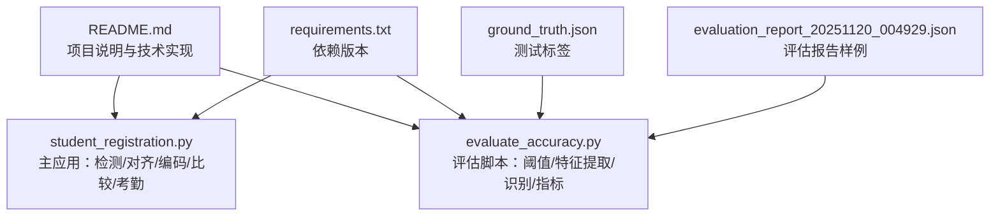
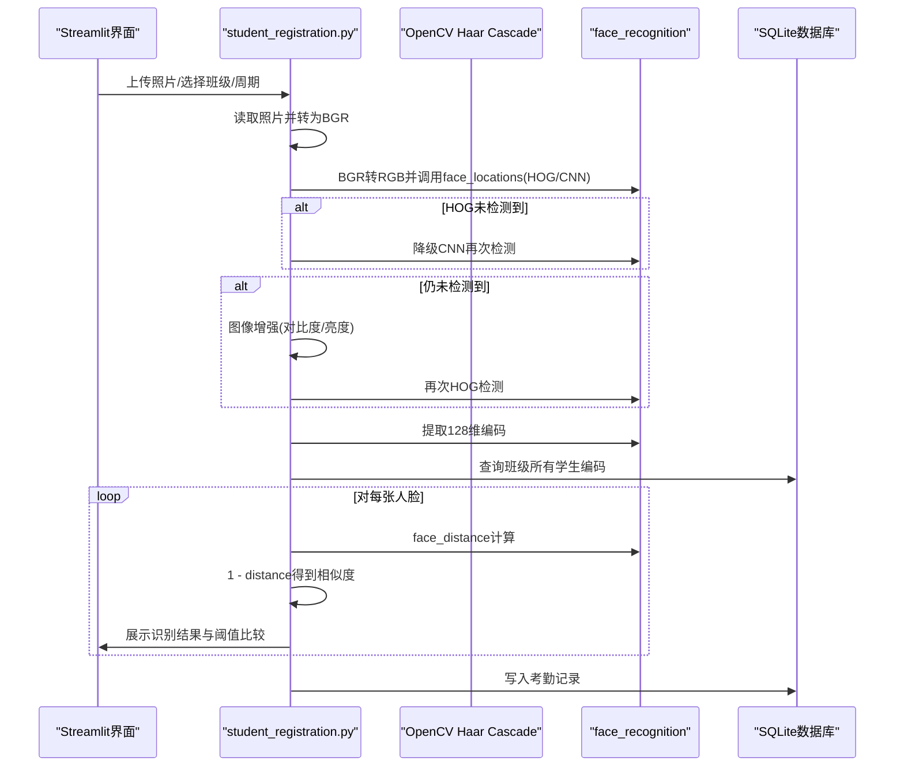
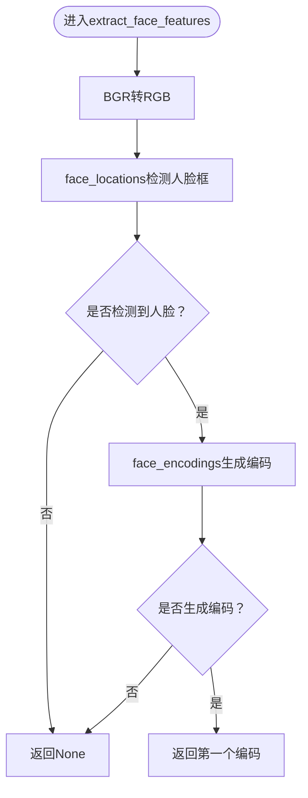
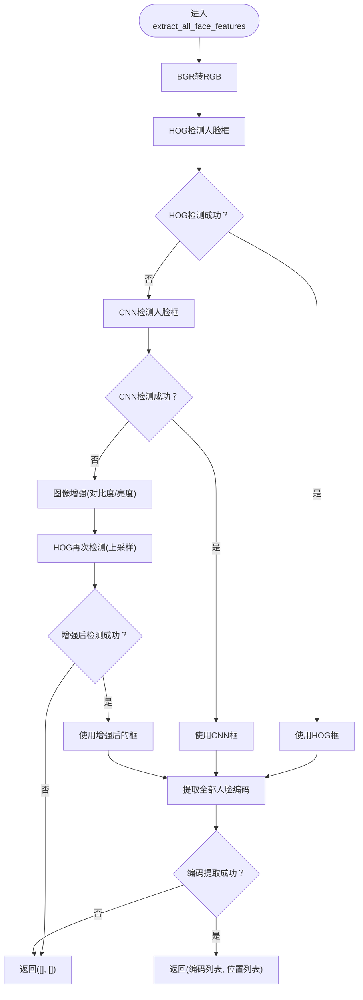
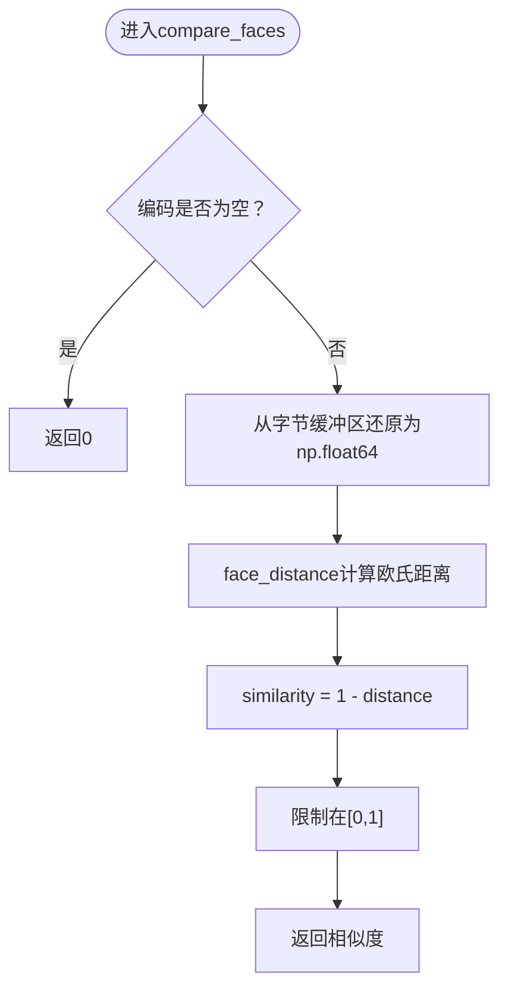
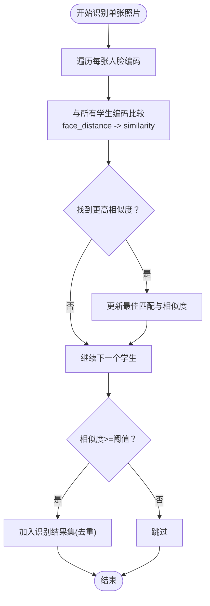
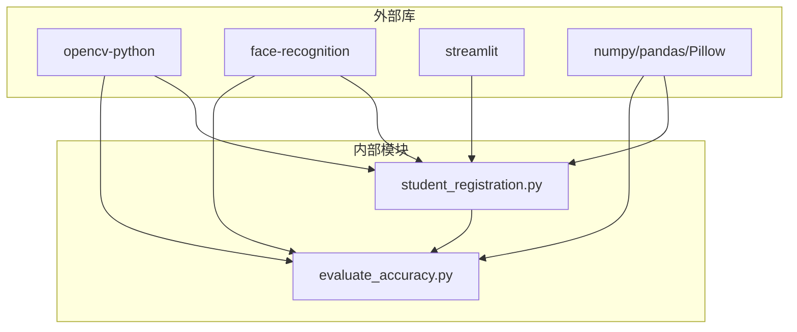

# 人脸识别原理

<cite>
**本文引用的文件**
- [README.md](file://README.md)
- [requirements.txt](file://requirements.txt)
- [student_registration.py](file://student_registration.py)
- [evaluate_accuracy.py](file://evaluate_accuracy.py)
- [ground_truth.json](file://ground_truth.json)
- [evaluation_report_20251120_004929.json](file://evaluation_report_20251120_004929.json)
</cite>

## 目录
1. [引言](#引言)
2. [项目结构](#项目结构)
3. [核心组件](#核心组件)
4. [架构总览](#架构总览)
5. [详细组件分析](#详细组件分析)
6. [依赖关系分析](#依赖关系分析)
7. [性能考量](#性能考量)
8. [故障排查指南](#故障排查指南)
9. [结论](#结论)
10. [附录](#附录)

## 引言
本文件围绕系统中的人脸识别技术原理展开，系统采用“人脸检测（OpenCV Haar Cascade）+ 人脸对齐（face_recognition 模型）+ 特征提取（face_recognition 生成128维编码）+ 相似度比较（欧氏距离转相似度）”的完整流水线。文档重点解释：
- extract_face_features 与 extract_all_face_features 的内部流程、色彩空间处理（BGR到RGB）与错误处理策略
- compare_faces 如何将两个128维编码通过欧氏距离转换为0~1的相似度分数
- 结合 evaluate_accuracy.py 的评估逻辑，说明0.42阈值在评估阶段与0.4阈值在考勤阶段的差异及权衡
- 影响识别准确率的关键因素（光照、角度、图像质量等）与故障排查建议

## 项目结构
仓库包含四个主要文件：
- README.md：项目概述、技术实现、故障排查
- requirements.txt：依赖版本清单（OpenCV、face_recognition、Streamlit等）
- student_registration.py：主应用逻辑，包含人脸检测、特征提取、相似度比较、考勤标记等
- evaluate_accuracy.py：离线评估脚本，包含阈值设置、特征提取、识别与指标统计
- ground_truth.json：测试集的真实标签
- evaluation_report_20251120_004929.json：评估报告输出样例

图表来源
- [README.md](file://README.md#L1-L127)
- [requirements.txt](file://requirements.txt#L1-L6)
- [student_registration.py](file://student_registration.py#L1-L120)
- [evaluate_accuracy.py](file://evaluate_accuracy.py#L1-L45)
- [ground_truth.json](file://ground_truth.json#L1-L11)
- [evaluation_report_20251120_004929.json](file://evaluation_report_20251120_004929.json#L1-L20)

章节来源
- [README.md](file://README.md#L1-L127)
- [requirements.txt](file://requirements.txt#L1-L6)

## 核心组件
- 人脸检测与对齐：使用 OpenCV 的 Haar Cascade 分类器进行初始检测；随后由 face_recognition 的模型进行对齐与特征提取（HOG/CNN两种模型）
- 特征提取：face_recognition 生成128维浮点编码，存储于数据库中
- 相似度比较：基于欧氏距离计算，再映射到0~1区间作为相似度
- 考勤标记：在考勤阶段使用0.4阈值，评估阶段使用0.42阈值，体现不同场景下的权衡

章节来源
- [README.md](file://README.md#L28-L41)
- [student_registration.py](file://student_registration.py#L56-L122)
- [evaluate_accuracy.py](file://evaluate_accuracy.py#L25-L45)

## 架构总览
系统整体由“前端界面（Streamlit）+ 数据库（SQLite）+ 人脸识别引擎（OpenCV + face_recognition）”构成。识别流程如下：

图表来源
- [student_registration.py](file://student_registration.py#L56-L122)
- [student_registration.py](file://student_registration.py#L490-L683)

## 详细组件分析

### 人脸检测与特征提取：extract_face_features
- 输入：BGR图像
- 处理步骤：
  - 将BGR转换为RGB（face_recognition要求RGB）
  - 使用face_recognition.face_locations检测人脸框
  - 若检测到人脸，调用face_encodings生成128维编码
  - 返回第一个编码（用于单人注册）
- 错误处理：
  - 未检测到人脸返回None
  - 编码为空也返回None
  - 外层调用方需提示用户更换照片

图表来源
- [student_registration.py](file://student_registration.py#L56-L76)

章节来源
- [student_registration.py](file://student_registration.py#L56-L76)

### 人脸检测与特征提取：extract_all_face_features（考勤场景）
- 输入：BGR图像
- 处理步骤：
  - BGR转RGB
  - 优先使用HOG模型检测人脸框（更快）
  - 若HOG未检测到，尝试CNN模型（更准确）
  - 若仍未检测到，进行图像增强（对比度/亮度提升），再以HOG检测
  - 检测到人脸框后，提取全部人脸编码
- 错误处理：
  - 多次尝试失败返回空列表
  - 检测到框但无法提取编码时提示并返回空列表
  - UI层提供建议与提示

图表来源
- [student_registration.py](file://student_registration.py#L77-L127)

章节来源
- [student_registration.py](file://student_registration.py#L77-L127)

### 相似度比较：compare_faces
- 输入：待比较的编码1（当前帧人脸编码），编码2（数据库中存储的编码）
- 处理步骤：
  - 将存储编码从字节缓冲区还原为np.float64数组
  - 使用face_recognition.face_distance计算欧氏距离（越小越相似）
  - 将距离映射为相似度：similarity = 1 - distance
  - 限制范围在[0,1]
- 错误处理：
  - 任一编码为空返回0
  - 异常捕获并返回0，同时输出错误日志

图表来源
- [student_registration.py](file://student_registration.py#L128-L146)

章节来源
- [student_registration.py](file://student_registration.py#L128-L146)

### 考勤识别与阈值策略
- 考勤阶段（mark_attendance）：
  - 对每张照片中检测到的每张人脸，遍历所有学生编码，计算相似度
  - 使用阈值0.4进行判定，若最高相似度≥0.4则认为识别成功
  - 保留每个学生最高相似度，避免重复记录
- 评估阶段（evaluate_accuracy.py）：
  - 使用阈值0.42进行识别，便于评估更严格条件下的性能
  - 输出精确率、召回率、F1与准确率等指标

图表来源
- [student_registration.py](file://student_registration.py#L565-L590)
- [evaluate_accuracy.py](file://evaluate_accuracy.py#L25-L45)
- [evaluate_accuracy.py](file://evaluate_accuracy.py#L74-L106)

章节来源
- [student_registration.py](file://student_registration.py#L565-L590)
- [evaluate_accuracy.py](file://evaluate_accuracy.py#L25-L45)
- [evaluate_accuracy.py](file://evaluate_accuracy.py#L74-L106)

### 评估指标与阈值说明
- 评估脚本使用ground_truth.json作为真实标签，逐张照片统计：
  - 真正例（TP）：识别正确的学生数
  - 假正例（FP）：误识别的学生数
  - 假负例（FN）：漏识别的学生数
  - 精确率、召回率、F1、准确率均按公式计算
- 报告样例显示阈值为0.42，总体指标稳定，表明在评估场景下该阈值能较好平衡误检与漏检

章节来源
- [evaluate_accuracy.py](file://evaluate_accuracy.py#L105-L141)
- [evaluate_accuracy.py](file://evaluate_accuracy.py#L190-L227)
- [ground_truth.json](file://ground_truth.json#L1-L11)
- [evaluation_report_20251120_004929.json](file://evaluation_report_20251120_004929.json#L1-L20)

## 依赖关系分析
- 外部库：
  - OpenCV：提供Haar Cascade分类器与图像处理能力
  - face_recognition：提供人脸检测（HOG/CNN）、对齐与128维编码
  - Streamlit：提供Web界面交互
  - NumPy/Pandas/Pillow：数据处理与图像读写
- 内部模块：
  - student_registration.py：主业务逻辑（检测、编码、比较、考勤）
  - evaluate_accuracy.py：离线评估（阈值、识别、指标）

图表来源
- [requirements.txt](file://requirements.txt#L1-L6)
- [student_registration.py](file://student_registration.py#L1-L40)
- [evaluate_accuracy.py](file://evaluate_accuracy.py#L1-L25)

章节来源
- [requirements.txt](file://requirements.txt#L1-L6)

## 性能考量
- 模型选择：
  - HOG模型速度快但可能漏检，CNN模型更准确但耗时较长
  - 系统在检测失败时自动降级到CNN，或通过图像增强后再检测，兼顾速度与精度
- 图像预处理：
  - 自动缩放大图以提升处理速度
  - 图像增强（对比度/亮度）可显著提升弱光或低质量图像的检测成功率
- 相似度计算：
  - face_distance返回欧氏距离，相似度=1-distance，范围[0,1]
  - 由于128维编码维度较高，距离度量在高维空间中通常较为稳定

章节来源
- [student_registration.py](file://student_registration.py#L509-L540)
- [student_registration.py](file://student_registration.py#L77-L127)
- [student_registration.py](file://student_registration.py#L128-L146)

## 故障排查指南
- 人脸检测失败：
  - 确保光线充足、人脸正面朝向、清晰可见
  - 提高图像分辨率，必要时裁剪使人脸更大
  - 尝试图像增强（对比度/亮度）
- 编码提取失败：
  - 确保检测到的人脸框内有清晰面部
  - 更换照片，避免遮挡或模糊
- 阈值相关问题：
  - 评估阶段使用0.42，考勤阶段使用0.4，前者更严格，后者更宽松
  - 若误识别增多，可适当提高阈值；若漏识别增多，可适当降低阈值
- 数据库问题：
  - 若出现数据库异常，可使用“删除数据库”选项重置，系统会自动重建结构

章节来源
- [README.md](file://README.md#L101-L112)
- [student_registration.py](file://student_registration.py#L102-L133)

## 结论
本系统通过OpenCV Haar Cascade进行初步检测，借助face_recognition完成对齐与128维编码提取，并以欧氏距离为基础的相似度比较实现身份匹配。在不同场景下采用不同的阈值策略（评估0.42 vs 考勤0.4），在保证识别效率的同时兼顾准确性。实际部署中，应重视图像质量、光照与角度等因素，并根据评估报告持续优化阈值与预处理策略。

## 附录
- 术语说明：
  - 人脸检测：定位图像中的人脸区域
  - 人脸对齐：将检测到的人脸区域标准化以便编码
  - 128维编码：face_recognition输出的高维特征向量
  - 欧氏距离：衡量两个向量间的直线距离
  - 相似度：通过1-distance映射到[0,1]区间