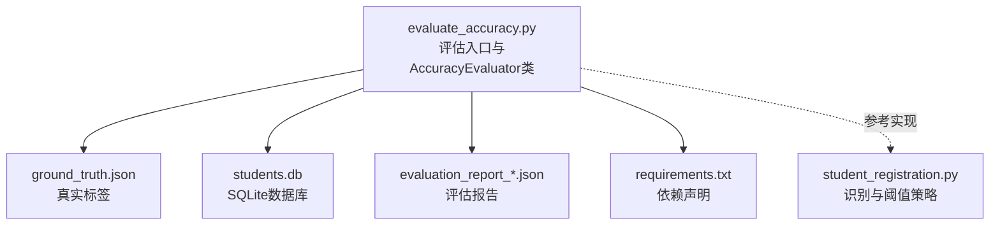
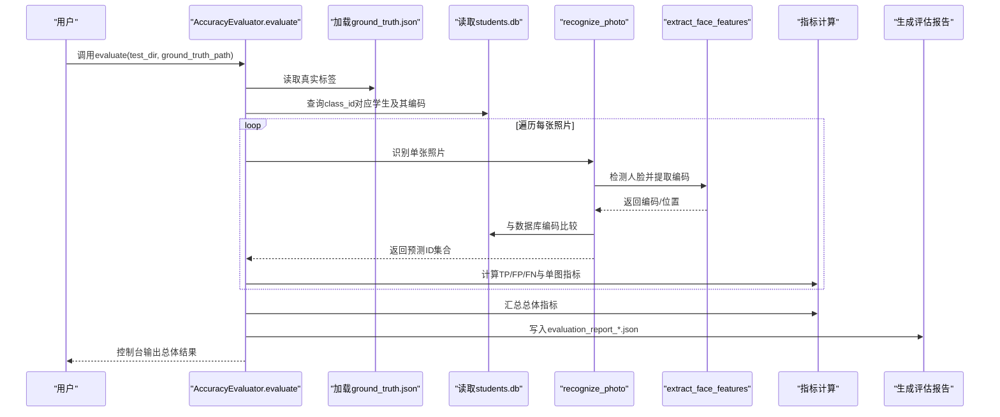
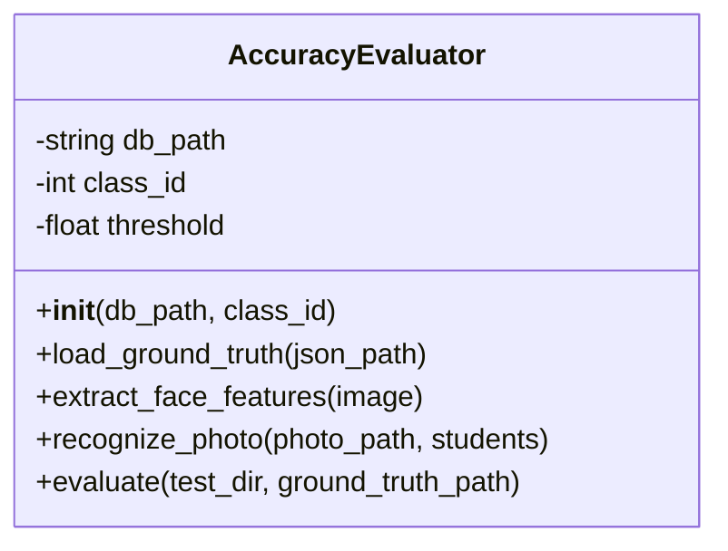
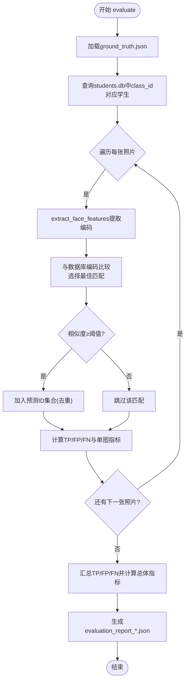
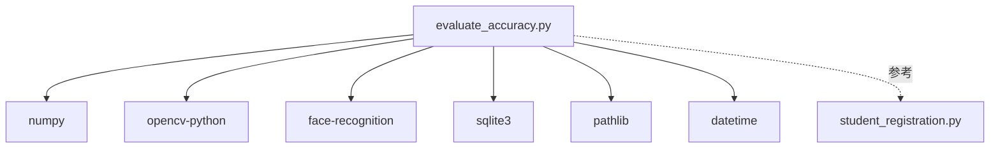

# 准确率评估

<cite>
**本文引用的文件**
- [evaluate_accuracy.py](file://evaluate_accuracy.py)
- [ground_truth.json](file://ground_truth.json)
- [evaluation_report_20251120_004929.json](file://evaluation_report_20251120_004929.json)
- [README.md](file://README.md)
- [requirements.txt](file://requirements.txt)
- [student_registration.py](file://student_registration.py)
</cite>

## 目录
1. [简介](#简介)
2. [项目结构](#项目结构)
3. [核心组件](#核心组件)
4. [架构总览](#架构总览)
5. [详细组件分析](#详细组件分析)
6. [依赖关系分析](#依赖关系分析)
7. [性能考虑](#性能考虑)
8. [故障排查指南](#故障排查指南)
9. [结论](#结论)
10. [附录](#附录)

## 简介
本文件面向“准确率评估工具”的使用者与维护者，系统性阐述 AccuracyEvaluator 类的设计理念与 evaluate 方法的执行流程；说明如何使用 ground_truth.json 作为真实标签，与系统识别结果进行对比；详解评估指标的计算方法（精确率 Precision、召回率 Recall、F1 分数、准确率 Accuracy）；给出基于现有代码的使用步骤与输出解读；并解释评估报告 evaluation_report_xxx.json 的结构与用途，帮助优化识别阈值与整体性能。

## 项目结构
- 评估脚本：evaluate_accuracy.py
- 真实标签：ground_truth.json
- 评估报告：evaluation_report_*.json
- 依赖声明：requirements.txt
- 主系统（参考）：student_registration.py（用于理解识别流程与阈值策略）
- 项目说明：README.md

图表来源
- [evaluate_accuracy.py](file://evaluate_accuracy.py#L1-L244)
- [ground_truth.json](file://ground_truth.json#L1-L11)
- [evaluation_report_20251120_004929.json](file://evaluation_report_20251120_004929.json#L1-L215)
- [requirements.txt](file://requirements.txt#L1-L6)
- [student_registration.py](file://student_registration.py#L490-L683)

章节来源
- [evaluate_accuracy.py](file://evaluate_accuracy.py#L1-L244)
- [ground_truth.json](file://ground_truth.json#L1-L11)
- [evaluation_report_20251120_004929.json](file://evaluation_report_20251120_004929.json#L1-L215)
- [requirements.txt](file://requirements.txt#L1-L6)
- [README.md](file://README.md#L1-L127)

## 核心组件
- AccuracyEvaluator 类：封装评估全流程，包括加载真实标签、从数据库读取学生特征、逐图识别、指标统计与报告生成。
- evaluate 方法：主流程控制，遍历 ground_truth.json 中的每张照片，调用识别函数，计算 TP/FP/FN 并汇总总体指标。
- 识别流程：从图像中检测人脸、提取编码、与数据库中存储的编码比较，按阈值筛选匹配，去重后得到预测集合。
- 报告结构：包含时间戳、阈值、总体指标与每张照片的明细结果。

章节来源
- [evaluate_accuracy.py](file://evaluate_accuracy.py#L25-L214)

## 架构总览
评估工具以 evaluate_accuracy.py 为核心，通过以下路径完成端到端评估：
- 输入：test_data 目录下的测试照片、ground_truth.json 真实标签、students.db 数据库（包含学生ID与人脸编码）。
- 处理：AccuracyEvaluator.evaluate 逐图执行识别，计算每张照片的 TP/FP/FN，再汇总得到总体 Precision、Recall、F1、Accuracy。
- 输出：在控制台打印总体结果，并生成 evaluation_report_*.json 保存详细统计。

图表来源
- [evaluate_accuracy.py](file://evaluate_accuracy.py#L98-L213)

## 详细组件分析

### AccuracyEvaluator 类设计
- 关键字段
  - db_path：数据库路径，默认 students.db
  - class_id：班级ID，用于筛选目标学生
  - threshold：识别阈值，默认 0.42
- 关键方法
  - load_ground_truth：读取 JSON 真实标签
  - extract_face_features：人脸检测与编码提取（优先 HOG，失败则 CNN，再尝试图像增强）
  - recognize_photo：对单张照片进行识别，返回预测学生ID集合（去重，满足阈值才加入）
  - evaluate：主流程，逐图评估并汇总指标，生成评估报告

图表来源
- [evaluate_accuracy.py](file://evaluate_accuracy.py#L25-L214)

章节来源
- [evaluate_accuracy.py](file://evaluate_accuracy.py#L25-L214)

### evaluate 方法执行流程
- 加载真实标签：从 ground_truth.json 读取每张照片的真实学生ID集合
- 读取学生数据：连接 students.db，查询 class_id 对应的学生及其人脸编码
- 逐图评估：
  - 读取图像并提取人脸编码
  - 与数据库中每个学生编码比较，计算相似度，保留最佳匹配
  - 若最佳相似度 ≥ 阈值，则将该学生ID加入预测集合（去重）
  - 计算单张照片的 TP/FP/FN 与 Precision/Recall/F1
- 汇总总体指标：将所有照片的 TP/FP/FN 汇总，计算总体 Precision、Recall、F1、Accuracy
- 生成评估报告：写入 evaluation_report_*.json，包含时间戳、阈值、总体指标与明细

图表来源
- [evaluate_accuracy.py](file://evaluate_accuracy.py#L98-L213)

章节来源
- [evaluate_accuracy.py](file://evaluate_accuracy.py#L98-L213)

### 识别与阈值策略
- 人脸检测与编码提取：优先使用 HOG 模型，若未检测到则尝试 CNN 模型；若仍失败，尝试图像增强后再次 HOG 检测。
- 相似度计算：将数据库中存储的二进制编码还原为 numpy 数组，计算欧氏距离并转换为相似度（1 - 距离）。
- 阈值：AccuracyEvaluator.threshold 默认 0.42；在主系统（考勤打卡）中识别阈值为 0.4，用于降低漏识风险。

章节来源
- [evaluate_accuracy.py](file://evaluate_accuracy.py#L36-L97)
- [student_registration.py](file://student_registration.py#L490-L683)

### 评估指标计算方法
- 单图指标（基于每张照片的预测集合与真实集合）：
  - Precision = TP / (TP + FP)，若预测集为空则 Precision = 0
  - Recall = TP / (TP + FN)，若真实集为空则 Recall = 0
  - F1 = 2 × Precision × Recall / (Precision + Recall)，若两者之和为 0 则 F1 = 0
- 总体指标（基于所有照片汇总）：
  - Precision = ΣTP / (ΣTP + ΣFP)
  - Recall = ΣTP / (ΣTP + ΣFN)
  - F1 = 2 × Precision × Recall / (Precision + Recall)
  - Accuracy = ΣTP / Σ(真实学生总数)

章节来源
- [evaluate_accuracy.py](file://evaluate_accuracy.py#L133-L174)

### 使用示例与步骤
- 准备测试照片：将待评估的群拍照放入 test_data 目录
- 准备真实标签：创建 ground_truth.json，键为照片文件名，值为该照片中出现的学生ID列表
- 运行评估：直接运行 evaluate_accuracy.py，脚本会自动检查 test_data 与 ground_truth.json 是否存在，随后执行评估并生成评估报告
- 查看结果：控制台输出总体指标；同时生成 evaluation_report_*.json 文件，包含时间戳、阈值、总体指标与每张照片的明细

章节来源
- [evaluate_accuracy.py](file://evaluate_accuracy.py#L216-L244)

### 评估报告结构与解读
- 结构要点
  - timestamp：评估时间
  - threshold：使用的识别阈值
  - overall_metrics：总体指标与统计
    - precision、recall、f1_score、accuracy
    - total_photos、total_students、true_positives、false_positives、false_negatives
  - detailed_results：每张照片的明细
    - photo、true_ids、predicted_ids、tp、fp、fn、precision、recall、f1
- 如何优化阈值
  - 若 recall 较低而 fp 较高，可适当降低阈值（例如从 0.42 降至 0.4），以减少漏识
  - 若 fp 较高而 precision 下降，可适当提高阈值，以提升识别稳健性
  - 建议在不同阈值下多次评估，观察 Precision/Recall/F1 的权衡，选择最符合业务需求的阈值

章节来源
- [evaluation_report_20251120_004929.json](file://evaluation_report_20251120_004929.json#L1-L215)
- [evaluate_accuracy.py](file://evaluate_accuracy.py#L189-L213)

## 依赖关系分析
- 外部库
  - numpy、opencv-python、face-recognition：用于图像处理与人脸特征提取、比较
  - sqlite3：访问 students.db
  - pathlib、datetime：文件路径与时间戳
- 内部模块
  - evaluate_accuracy.py：核心评估逻辑
  - student_registration.py：参考识别流程与阈值策略

图表来源
- [evaluate_accuracy.py](file://evaluate_accuracy.py#L17-L24)
- [requirements.txt](file://requirements.txt#L1-L6)
- [student_registration.py](file://student_registration.py#L1-L120)

章节来源
- [requirements.txt](file://requirements.txt#L1-L6)
- [evaluate_accuracy.py](file://evaluate_accuracy.py#L17-L24)

## 性能考虑
- 人脸检测模型选择：HOG 模型速度快但可能检测较少，CNN 模型更准确但较慢；当 HOG 未检测到时再尝试 CNN，必要时进行图像增强，平衡准确率与速度。
- 相似度计算：将数据库中的二进制编码还原为 numpy 数组后进行距离计算，注意内存占用与类型一致性。
- 阈值影响：阈值越低，召回率越高但误识率上升；阈值越高，精度提升但漏识增加。建议结合业务场景进行权衡。
- I/O 与数据库访问：评估过程中频繁读取数据库，建议确保 students.db 存储在本地 SSD 或使用合适的索引策略（如按 class_id 查询）。

[本节为通用指导，无需特定文件来源]

## 故障排查指南
- 无法读取照片或未检测到人脸
  - 检查 test_data 目录与照片路径是否正确
  - 确认照片清晰、正面、无遮挡
  - 若持续未检测到人脸，尝试改善光照条件或使用更高分辨率照片
- 数据库中没有学生数据
  - 确认 students.db 已初始化且 class_id 正确
  - 检查 students 表中是否存在 class_id 对应的记录
- 评估报告未生成
  - 确认脚本正常执行完毕，检查控制台输出的报告保存路径
- 阈值设置不当导致误识或漏识
  - 根据评估报告的 Precision/Recall/F1 调整阈值，逐步微调以达到最优平衡

章节来源
- [evaluate_accuracy.py](file://evaluate_accuracy.py#L98-L213)

## 结论
AccuracyEvaluator 通过标准化的评估流程，将系统识别结果与真实标签进行严格对比，提供 Precision、Recall、F1、Accuracy 四项关键指标，并输出详细的评估报告。结合阈值策略与报告数据，可以有效定位系统在准确率与召回率上的短板，指导识别阈值优化与图像采集规范改进，从而持续提升人脸识别考勤系统的整体性能。

[本节为总结性内容，无需特定文件来源]

## 附录

### 附录A：ground_truth.json 示例与说明
- 结构：键为照片文件名，值为该照片中出现的学生ID列表
- 作用：作为真实标签，用于与系统识别结果对比，计算 TP/FP/FN

章节来源
- [ground_truth.json](file://ground_truth.json#L1-L11)

### 附录B：requirements.txt 依赖说明
- streamlit、numpy、pandas、Pillow：UI与数据处理
- opencv-python、face-recognition：图像与人脸识别

章节来源
- [requirements.txt](file://requirements.txt#L1-L6)

### 附录C：主系统识别阈值参考
- 主系统（考勤打卡）识别阈值为 0.4，用于降低漏识风险
- 评估工具默认阈值为 0.42，便于更严格地评估系统稳健性

章节来源
- [student_registration.py](file://student_registration.py#L574-L579)
- [evaluate_accuracy.py](file://evaluate_accuracy.py#L25-L35)