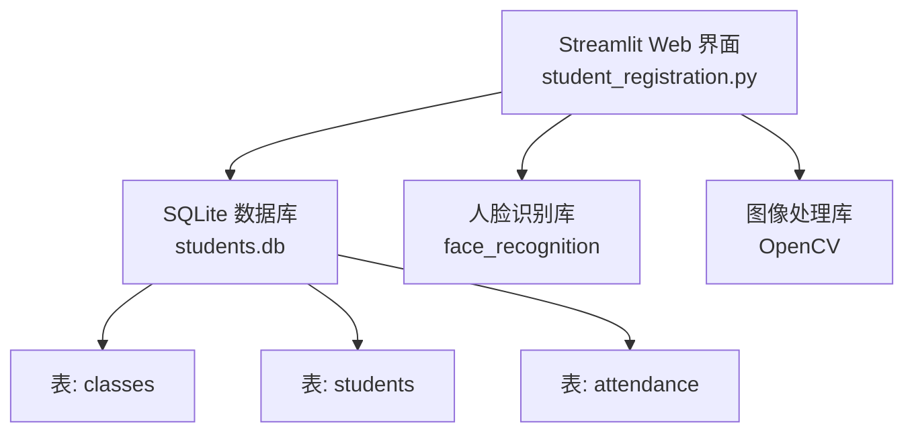
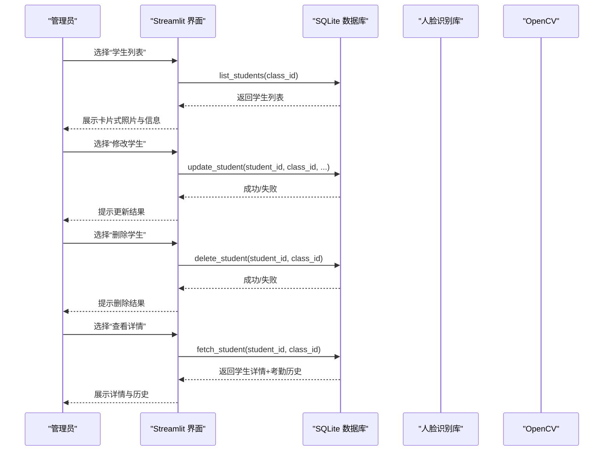
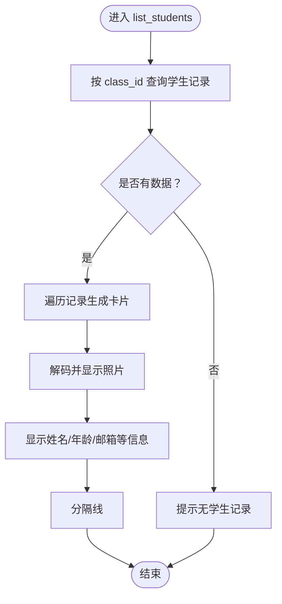
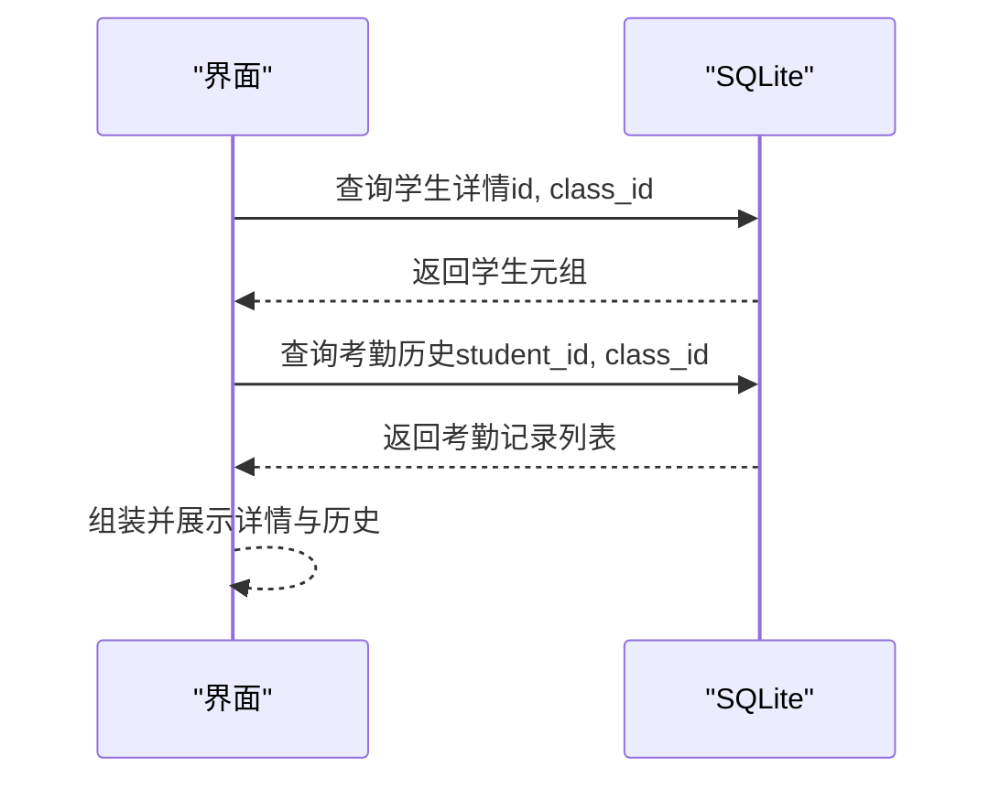
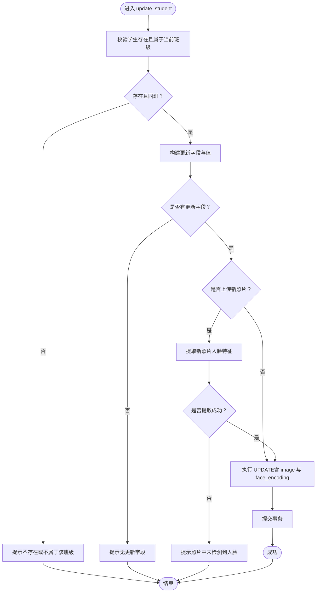
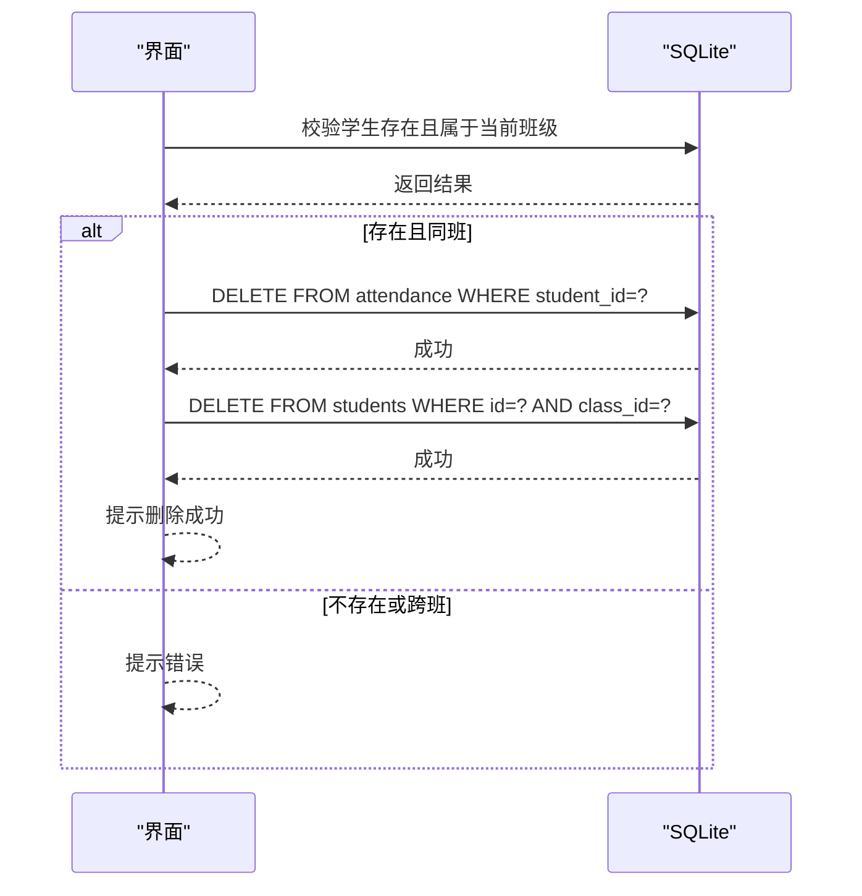
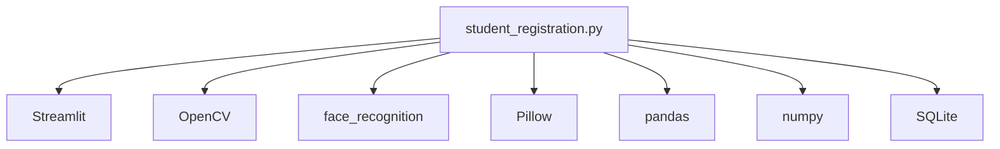

# 学生信息管理

<cite>
**本文引用的文件**
- [README.md](file://README.md)
- [requirements.txt](file://requirements.txt)
- [student_registration.py](file://student_registration.py)
</cite>

## 目录
1. [简介](#简介)
2. [项目结构](#项目结构)
3. [核心组件](#核心组件)
4. [架构总览](#架构总览)
5. [详细组件分析](#详细组件分析)
6. [依赖分析](#依赖分析)
7. [性能考虑](#性能考虑)
8. [故障排查指南](#故障排查指南)
9. [结论](#结论)
10. [附录](#附录)

## 简介
本文件围绕“学生信息管理”功能展开，重点覆盖以下函数的实现与使用方式：
- list_students：按班级查询并展示学生列表，以卡片形式呈现照片与基本信息。
- fetch_student：根据学生ID与班级ID获取学生详情及考勤历史。
- update_student：修改学生信息，包含邮箱唯一性校验与照片变更时的人脸特征重提。
- delete_student：删除学生并级联删除其考勤记录。

同时，文档解释了数据库结构、Web界面交互流程、验证逻辑与错误处理策略，并强调该功能集为管理员提供完整的CRUD能力。

## 项目结构
- 主程序入口为 Web 应用，基于 Streamlit 构建，负责用户交互与调用后端数据库操作。
- 数据库采用 SQLite，包含三张核心表：classes、students、attendance。
- 人脸识别与特征提取由 OpenCV 和 face_recognition 库配合完成。

图表来源
- [student_registration.py](file://student_registration.py#L1-L60)
- [README.md](file://README.md#L36-L41)

章节来源
- [README.md](file://README.md#L28-L41)
- [student_registration.py](file://student_registration.py#L1-L60)

## 核心组件
- 数据库初始化与结构
  - 初始化函数负责创建 classes、students、attendance 表，设置外键关系与唯一约束。
  - students 表包含 class_id、name、age、email（唯一）、image（BLOB）、face_encoding（BLOB）等字段。
- 列表展示 list_students
  - 通过 class_id 查询 students 表，返回学生记录并以卡片形式展示照片与基本信息。
- 详情获取 fetch_student
  - 通过学生ID与班级ID查询学生详情，并关联查询该学生的考勤历史。
- 修改 update_student
  - 支持按需更新 name、age、email、photo；若更新照片则重新提取人脸特征并写入数据库。
  - 包含邮箱唯一性约束校验与“仅允许同班修改”的安全校验。
- 删除 delete_student
  - 先删除 attendance 中对应学生的所有记录，再删除 students 中该学生记录。
- 人脸识别与特征提取
  - 单张照片特征提取用于注册；多张照片特征提取用于考勤识别。

章节来源
- [student_registration.py](file://student_registration.py#L18-L49)
- [student_registration.py](file://student_registration.py#L280-L339)
- [student_registration.py](file://student_registration.py#L453-L488)
- [student_registration.py](file://student_registration.py#L340-L414)
- [student_registration.py](file://student_registration.py#L415-L452)
- [student_registration.py](file://student_registration.py#L57-L76)
- [student_registration.py](file://student_registration.py#L77-L127)

## 架构总览
下图展示了 Web 界面与数据库之间的交互关系，以及关键函数在流程中的作用。

图表来源
- [student_registration.py](file://student_registration.py#L280-L339)
- [student_registration.py](file://student_registration.py#L340-L414)
- [student_registration.py](file://student_registration.py#L415-L452)
- [student_registration.py](file://student_registration.py#L453-L488)

## 详细组件分析

### list_students：按班级查询并展示学生卡片
- 功能要点
  - 通过 class_id 查询 students 表，返回 id、name、age、email、image 字段。
  - 使用两列布局展示照片与基本信息，形成卡片式 UI。
  - 若无学生记录，提示“该班级暂无注册学生”。
- 数据流
  - 输入：class_id
  - 查询：students 表 WHERE class_id = ?
  - 输出：学生列表卡片（照片 + 信息）
- 错误处理
  - 查询异常时输出错误信息并打印堆栈。
- 性能与可用性
  - 照片以 Blob 存储，展示时按需解码；建议控制图片大小避免过大影响渲染。

图表来源
- [student_registration.py](file://student_registration.py#L280-L339)

章节来源
- [student_registration.py](file://student_registration.py#L280-L339)

### fetch_student：获取学生详情与考勤历史
- 功能要点
  - 通过学生ID与班级ID查询学生详情（id、name、age、email、face_encoding）。
  - 同时查询该学生在当前班级的考勤历史（date、period、status），按日期与节次排序。
- 数据流
  - 输入：student_id、class_id
  - 查询：students 表 WHERE id=? AND class_id=?
  - 查询：attendance 表 WHERE student_id=? AND class_id=?
  - 输出：学生元组 + 考勤记录列表
- 错误处理
  - 未找到或跨班访问时提示错误。
- 实际应用
  - 用于“查看详情”页面，展示学生基础信息与历史出勤。

图表来源
- [student_registration.py](file://student_registration.py#L453-L488)

章节来源
- [student_registration.py](file://student_registration.py#L453-L488)

### update_student：修改学生信息与照片重提特征
- 功能要点
  - 仅允许修改“属于当前班级”的学生，防止跨班越权修改。
  - 支持按需更新 name、age、email、photo。
  - 若更新照片，会重新提取人脸特征并写回数据库。
  - 邮箱字段具有唯一性约束，冲突时提示“邮箱已被其他学生使用”。
- 安全与验证
  - 先校验学生是否存在且属于当前班级。
  - 对 email 唯一性通过数据库约束触发异常处理。
  - 对新照片进行人脸检测，若未检测到人脸则拒绝更新。
- 数据流
  - 输入：student_id、class_id、name、age、email、photo
  - 校验：SELECT id FROM students WHERE id=? AND class_id=?
  - 更新：动态拼接 SET 子句，若含 photo 则附加 image 与 face_encoding
  - 写入：UPDATE students SET ... WHERE id=? AND class_id=?
- 错误处理
  - IntegrityError：邮箱冲突
  - 其他异常：捕获并输出错误信息与堆栈

图表来源
- [student_registration.py](file://student_registration.py#L340-L414)

章节来源
- [student_registration.py](file://student_registration.py#L340-L414)

### delete_student：删除学生并级联删除考勤记录
- 功能要点
  - 先校验学生存在且属于当前班级。
  - 删除该学生在 attendance 表中的全部记录（级联删除）。
  - 再删除 students 表中的该学生记录。
- 安全与验证
  - 通过 WHERE id=? AND class_id=? 限制删除范围，防止跨班误删。
- 错误处理
  - 异常捕获并输出错误信息与堆栈。

图表来源
- [student_registration.py](file://student_registration.py#L415-L452)

章节来源
- [student_registration.py](file://student_registration.py#L415-L452)

### Web 界面交互与数据展示
- 学生列表
  - 通过 list_students 展示卡片式照片与信息，便于直观浏览。
- 修改学生
  - 选择学生后输入新信息，点击保存触发 update_student。
- 删除学生
  - 二次确认后触发 delete_student，并提示级联删除考勤记录。
- 查看详情
  - 输入学生ID与班级ID，调用 fetch_student 展示详情与历史。

章节来源
- [student_registration.py](file://student_registration.py#L836-L1005)

## 依赖分析
- 外部库
  - Streamlit：Web 界面框架
  - OpenCV：图像处理与人脸检测
  - face_recognition：人脸特征提取与距离比较
  - Pillow：图像解码与显示
  - pandas：考勤统计与表格展示
  - numpy：数组与数值计算
- 数据库
  - SQLite：本地存储，三张核心表，外键约束保证数据一致性。

图表来源
- [requirements.txt](file://requirements.txt#L1-L6)
- [student_registration.py](file://student_registration.py#L1-L20)

章节来源
- [requirements.txt](file://requirements.txt#L1-L6)
- [student_registration.py](file://student_registration.py#L1-L20)

## 性能考虑
- 特征提取
  - 单张注册照片使用 extract_face_features；多张考勤照片使用 extract_all_face_features 并尝试 HOG/CNN 双模型与图像增强。
- 图像尺寸
  - 考勤处理中对大图进行缩放以提升处理速度。
- 数据库查询
  - 按 class_id 进行过滤，减少扫描范围；索引建议：在 students 上对 class_id 建立索引可进一步优化。
- UI 渲染
  - 学生列表以卡片形式展示，注意 Blob 图片解码与显示的开销，建议控制图片尺寸与数量。

章节来源
- [student_registration.py](file://student_registration.py#L77-L127)
- [student_registration.py](file://student_registration.py#L489-L683)

## 故障排查指南
- 人脸特征提取失败
  - 现象：注册或更新照片时报“未检测到人脸”。
  - 排查：确保照片光线充足、正面清晰、人脸完整；必要时裁剪放大人脸区域。
- 邮箱唯一性冲突
  - 现象：更新邮箱时报“邮箱已被其他学生使用”。
  - 排查：检查目标邮箱是否已被其他学生占用，更换唯一邮箱。
- 跨班访问或删除失败
  - 现象：提示“学生不存在或不属于该班级”。
  - 排查：确认所选班级与学生ID匹配；避免跨班操作。
- 数据库异常
  - 现象：界面提示数据库错误或无法连接。
  - 排查：使用“删除数据库”选项重置，系统会自动重建表结构。

章节来源
- [student_registration.py](file://student_registration.py#L254-L281)
- [student_registration.py](file://student_registration.py#L340-L414)
- [student_registration.py](file://student_registration.py#L415-L452)
- [student_registration.py](file://student_registration.py#L994-L1005)

## 结论
本功能集通过 list_students、fetch_student、update_student、delete_student 四个核心函数，结合数据库约束与前端交互，为管理员提供了面向班级的学生数据完整 CRUD 能力。其中：
- list_students 以卡片形式直观展示学生照片与信息；
- fetch_student 提供学生详情与考勤历史；
- update_student 在安全校验与邮箱唯一性约束下支持照片重提特征；
- delete_student 实现级联删除，保障数据一致性。

配合人脸识别与考勤模块，系统实现了从“录入—展示—维护—统计”的闭环管理。

## 附录
- 数据库表结构（classes、students、attendance）
- 人脸识别流程与阈值调整
- Web 界面菜单与操作路径

章节来源
- [README.md](file://README.md#L36-L41)
- [student_registration.py](file://student_registration.py#L57-L76)
- [student_registration.py](file://student_registration.py#L489-L683)