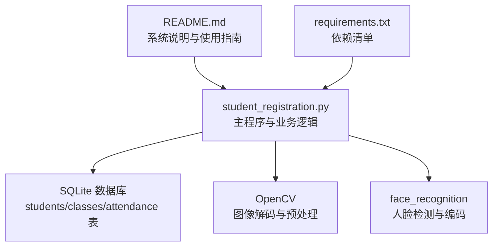
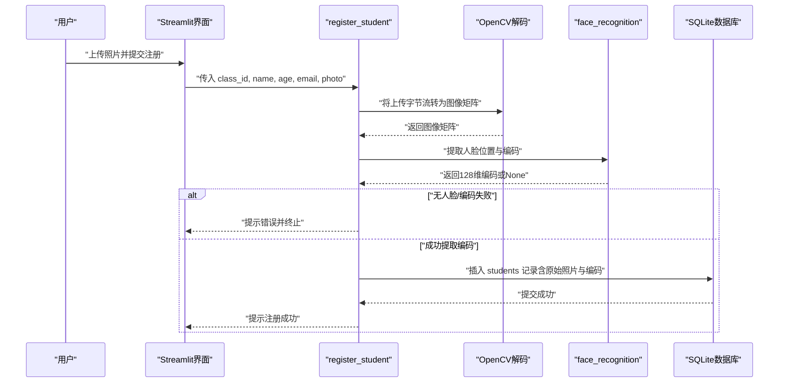
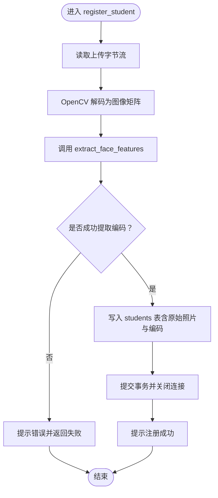
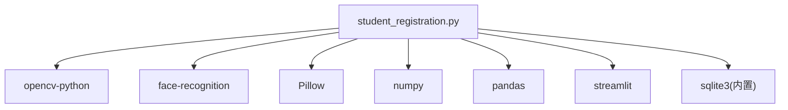

# 学生注册

<cite>
**本文引用的文件**
- [student_registration.py](file://student_registration.py)
- [README.md](file://README.md)
- [requirements.txt](file://requirements.txt)
</cite>

## 目录
1. [简介](#简介)
2. [项目结构](#项目结构)
3. [核心组件](#核心组件)
4. [架构总览](#架构总览)
5. [详细组件分析](#详细组件分析)
6. [依赖关系分析](#依赖关系分析)
7. [性能考虑](#性能考虑)
8. [故障排查指南](#故障排查指南)
9. [结论](#结论)
10. [附录](#附录)

## 简介
本文件围绕“学生注册”功能展开，聚焦于 register_student 函数的实现流程，解释如何从用户上传的照片中读取图像、使用 OpenCV 解码、通过 Haar Cascade 进行人脸检测、再利用 face_recognition 库生成 128 维人脸编码，并将人脸编码与学生姓名、年龄、邮箱、原始照片等信息一并存储到 SQLite 数据库的 students 表中。文档还提供端到端的数据流图、常见问题与解决方案，帮助开发者与使用者快速理解与排障。

## 项目结构
- 主程序入口为 student_registration.py，包含数据库初始化、人脸特征提取、注册、考勤等功能。
- README.md 提供系统特性、技术实现概览与安装使用说明。
- requirements.txt 列出运行所需依赖（Streamlit、OpenCV、face_recognition、Pillow、NumPy、pandas）。

图表来源
- [student_registration.py](file://student_registration.py#L1-L120)
- [README.md](file://README.md#L1-L127)
- [requirements.txt](file://requirements.txt#L1-L6)

章节来源
- [student_registration.py](file://student_registration.py#L1-L120)
- [README.md](file://README.md#L1-L127)
- [requirements.txt](file://requirements.txt#L1-L6)

## 核心组件
- 数据库初始化与表结构
  - 初始化数据库连接，创建 classes、students、attendance 三张表；students 表包含 class_id、name、age、email、image（BLOB）、face_encoding（BLOB）等字段。
- 人脸特征提取
  - extract_face_features：将 BGR 图像转为 RGB，使用 face_recognition 的 face_locations 与 face_encodings 生成 128 维编码；若无人脸或无法提取编码则返回 None。
- 注册流程
  - register_student：读取上传照片字节流，OpenCV 解码为矩阵，调用 extract_face_features 获取编码，随后写入 students 表（含原始照片字节与编码字节）。
- UI 交互
  - Streamlit 页面提供“注册学生”入口，收集姓名、年龄、邮箱与照片，触发注册流程。

章节来源
- [student_registration.py](file://student_registration.py#L18-L53)
- [student_registration.py](file://student_registration.py#L57-L76)
- [student_registration.py](file://student_registration.py#L254-L281)
- [student_registration.py](file://student_registration.py#L836-L871)

## 架构总览
下图展示了从用户上传照片到数据库存储的完整数据流，以及人脸检测与编码的关键步骤。

图表来源
- [student_registration.py](file://student_registration.py#L254-L281)
- [student_registration.py](file://student_registration.py#L57-L76)
- [student_registration.py](file://student_registration.py#L18-L53)

## 详细组件分析

### register_student 函数详解
- 输入参数
  - class_id：所属班级 ID
  - name、age、email：学生基本信息
  - photo：上传的图像文件对象（支持 jpg/jpeg/png）
- 关键步骤
  1) 读取上传字节流并使用 OpenCV 解码为彩色图像矩阵。
  2) 调用 extract_face_features 生成 128 维人脸编码。
  3) 若编码为空，提示“未检测到人脸”，注册失败。
  4) 连接 students.db，将 class_id、name、age、email、原始照片字节、编码字节写入 students 表。
  5) 提交事务并关闭连接，提示注册成功。
- 错误处理
  - 捕获异常并输出错误信息，返回 False，避免中断 UI 流程。

图表来源
- [student_registration.py](file://student_registration.py#L254-L281)
- [student_registration.py](file://student_registration.py#L57-L76)

章节来源
- [student_registration.py](file://student_registration.py#L254-L281)

### 人脸特征提取与检测机制
- Haar Cascade 检测（用于考勤识别）
  - README 描述使用 OpenCV Haar Cascade 进行初始人脸检测，配合 face_recognition 的 HOG/CNN 模型进行更稳健的检测与编码。
  - extract_all_face_features 展示了 HOG/CNN 双模型策略与图像增强（对比度提升、上采样）以提升检测成功率。
- 注册专用提取
  - extract_face_features 仅提取第一张人脸的编码，适合单人注册场景；若无人脸或无法提取编码，直接返回 None，由调用方决定后续行为。

章节来源
- [README.md](file://README.md#L30-L41)
- [student_registration.py](file://student_registration.py#L77-L127)
- [student_registration.py](file://student_registration.py#L57-L76)

### 数据库设计与存储要点
- students 表字段
  - id、class_id、name、age、email、image（BLOB）、face_encoding（BLOB）
  - class_id 外键关联 classes 表
- 存储策略
  - 原始照片以 BLOB 存储，便于回显与复用
  - 人脸编码以 BLOB 存储，编码类型为 float64，长度固定 128
- 读取与显示
  - list_students 从数据库读取 image 并通过 PIL 打开显示
  - fetch_student 读取 face_encoding 并转换为 numpy 数组用于后续比较

章节来源
- [student_registration.py](file://student_registration.py#L18-L53)
- [student_registration.py](file://student_registration.py#L282-L339)
- [student_registration.py](file://student_registration.py#L453-L488)

### UI 与业务入口
- Streamlit 页面提供“注册学生”菜单项，收集 name、age、email、photo，并在点击注册按钮后调用 register_student。
- 页面顶部提供班级选择，确保注册归属正确班级。

章节来源
- [student_registration.py](file://student_registration.py#L836-L871)

## 依赖关系分析
- 外部库
  - OpenCV：图像解码与预处理
  - face_recognition：人脸检测与编码
  - Pillow：图像显示与转换
  - NumPy：数组与编码存储
  - pandas：考勤统计与展示
  - Streamlit：Web 界面与交互
- 内部模块
  - student_registration.py：数据库初始化、特征提取、注册、考勤、查询等核心逻辑

图表来源
- [requirements.txt](file://requirements.txt#L1-L6)
- [student_registration.py](file://student_registration.py#L1-L14)

章节来源
- [requirements.txt](file://requirements.txt#L1-L6)
- [student_registration.py](file://student_registration.py#L1-L14)

## 性能考虑
- 图像尺寸控制
  - 考勤识别中对大图进行缩放以提升处理速度，注册流程未做缩放，建议在上传前限制分辨率或在注册前做预处理，避免内存与 CPU 压力过大。
- 检测模型选择
  - HOG 快速但可能漏检，CNN 更准确但耗时；注册场景建议优先保证清晰度，必要时可采用 HOG 或 CNN 单模型策略。
- 编码存储格式
  - 128 维 float64 编码占用约 1KB，BLOB 存储合理；若需进一步压缩可评估量化方案，但需权衡精度。

[本节为通用性能建议，不直接分析具体文件]

## 故障排查指南
- 照片中无人脸
  - 现象：extract_face_features 返回 None，register_student 提示未检测到人脸。
  - 原因：照片未包含清晰正面人脸、角度过大、遮挡或光照不足。
  - 解决：确保照片清晰、正面、光线充足；必要时使用 extract_all_face_features 的增强策略（对比度提升、上采样）。
- 人脸模糊或特征提取失败
  - 现象：检测到人脸位置但无法提取编码。
  - 原因：图像模糊、分辨率过低、算法阈值过高。
  - 解决：提高分辨率、改善拍摄条件；必要时调整上采样次数或切换 CNN 模型。
- 数据库存储错误
  - 现象：注册时报错或无记录。
  - 原因：数据库连接失败、表结构缺失、唯一约束冲突（邮箱重复）。
  - 解决：检查 students.db 是否存在、verify_database 是否通过；确保邮箱唯一；必要时使用“删除数据库”重置后重建。
- UI 交互问题
  - 现象：页面无数据或报错。
  - 原因：未创建班级、未选择班级、依赖未安装。
  - 解决：先创建班级并选择；确认 requirements 安装完成；重启应用。

章节来源
- [student_registration.py](file://student_registration.py#L57-L76)
- [student_registration.py](file://student_registration.py#L77-L127)
- [student_registration.py](file://student_registration.py#L254-L281)
- [student_registration.py](file://student_registration.py#L148-L178)
- [README.md](file://README.md#L101-L116)

## 结论
学生注册功能通过“上传照片 -> OpenCV 解码 -> face_recognition 编码 -> SQLite 存储”的链路，实现了从用户输入到持久化的一体化流程。系统在注册阶段采用单人脸编码策略，在考勤阶段采用多模型与增强策略，兼顾易用性与准确性。针对常见问题（无人脸、模糊、数据库错误），提供了明确的定位与修复路径。建议在生产环境中增加上传前校验、日志记录与重试机制，以进一步提升稳定性与用户体验。

[本节为总结性内容，不直接分析具体文件]

## 附录
- 依赖安装
  - 使用 requirements.txt 安装所需包，确保 OpenCV 与 face_recognition 可用。
- 运行方式
  - 通过 Streamlit 启动 student_registration.py，按提示创建班级并注册学生。

章节来源
- [requirements.txt](file://requirements.txt#L1-L6)
- [README.md](file://README.md#L61-L76)