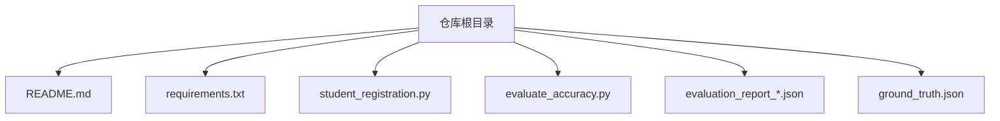
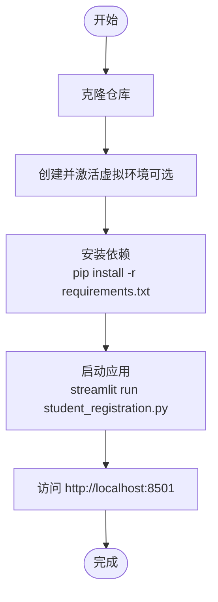
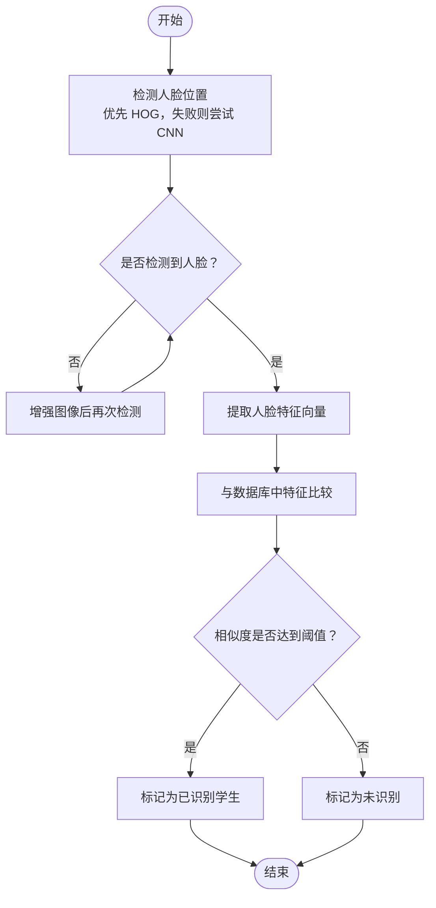
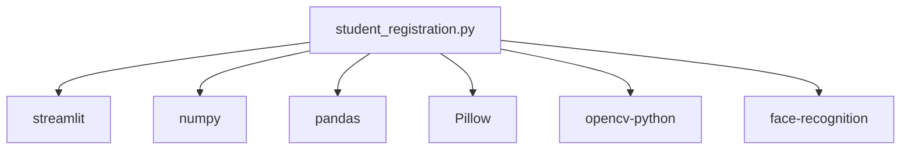

# 安装与配置

<cite>
**本文引用的文件**
- [README.md](file://README.md)
- [requirements.txt](file://requirements.txt)
- [student_registration.py](file://student_registration.py)
</cite>

## 目录
1. [简介](#简介)
2. [项目结构](#项目结构)
3. [核心组件](#核心组件)
4. [架构概览](#架构概览)
5. [详细组件分析](#详细组件分析)
6. [依赖关系分析](#依赖关系分析)
7. [性能考虑](#性能考虑)
8. [故障排除指南](#故障排除指南)
9. [结论](#结论)
10. [附录](#附录)

## 简介
本指南面向初学者与有经验的开发者，提供从零开始安装与配置人脸识别考勤系统的完整步骤。内容涵盖：
- 列出并解释所有必需的 Python 依赖包及版本要求
- 逐步说明如何克隆仓库、创建虚拟环境（可选）、使用 pip 安装依赖
- 解释 README.md 中的先决条件（Python 版本、网络连接、摄像头）
- 说明如何通过命令启动应用并访问本地服务端口
- 提供常见安装问题的故障排除建议

## 项目结构
该项目采用“单文件应用 + 简洁依赖”的组织方式，核心入口为一个 Streamlit 应用脚本，依赖通过 requirements.txt 统一管理。

图表来源
- [README.md](file://README.md#L1-L127)
- [requirements.txt](file://requirements.txt#L1-L6)
- [student_registration.py](file://student_registration.py#L1-L1005)

章节来源
- [README.md](file://README.md#L1-L127)
- [requirements.txt](file://requirements.txt#L1-L6)
- [student_registration.py](file://student_registration.py#L1-L1005)

## 核心组件
- 依赖清单：通过 requirements.txt 明确列出所有 Python 包及其精确版本，确保安装一致性与可复现性。
- 应用入口：student_registration.py 是 Streamlit 应用的主程序，负责数据库初始化、界面交互与业务逻辑。
- 文档与先决条件：README.md 提供功能说明、技术实现、先决条件与安装使用流程。

章节来源
- [requirements.txt](file://requirements.txt#L1-L6)
- [student_registration.py](file://student_registration.py#L1-L1005)
- [README.md](file://README.md#L42-L76)

## 架构概览
下图展示应用启动与依赖安装的关键路径，帮助理解从安装到运行的整体流程。

图表来源
- [README.md](file://README.md#L48-L76)
- [requirements.txt](file://requirements.txt#L1-L6)
- [student_registration.py](file://student_registration.py#L1-L1005)

## 详细组件分析

### 依赖包与版本要求
根据 requirements.txt 文件，系统需要以下 Python 包及版本：
- streamlit==1.32.0
- numpy==1.24.3
- pandas==2.0.3
- Pillow==10.0.0
- opencv-python==4.8.0.76
- face-recognition==1.3.0

这些包分别承担以下职责：
- streamlit：提供 Web 界面与交互式控件
- numpy：数值计算基础库
- pandas：数据处理与展示
- Pillow：图像读写与格式转换
- opencv-python：图像处理与人脸检测
- face-recognition：人脸特征提取与比较

章节来源
- [requirements.txt](file://requirements.txt#L1-L6)

### 先决条件与环境准备
根据 README.md，系统运行需满足以下先决条件：
- Python 3.8 或更高版本
- 可用的网络连接（首次安装依赖时需要）
- 摄像头设备（用于考勤拍照与演示）

章节来源
- [README.md](file://README.md#L42-L47)

### 安装与运行步骤
- 克隆仓库并进入目录
- 可选：创建并激活虚拟环境
- 安装依赖：pip install -r requirements.txt
- 启动应用：streamlit run student_registration.py
- 在浏览器中打开 http://localhost:8501 访问界面

章节来源
- [README.md](file://README.md#L48-L76)
- [requirements.txt](file://requirements.txt#L1-L6)
- [student_registration.py](file://student_registration.py#L1-L1005)

### 数据库初始化与验证
应用启动时会自动初始化 SQLite 数据库结构（classes、students、attendance 表）。若出现数据库错误，可使用“删除数据库”选项重置并重建结构。

章节来源
- [student_registration.py](file://student_registration.py#L18-L53)
- [student_registration.py](file://student_registration.py#L147-L178)
- [student_registration.py](file://student_registration.py#L994-L1005)

### 人脸检测与识别流程
应用在注册与考勤场景中使用 OpenCV 与 face_recognition 库进行人脸检测与特征提取，并通过相似度阈值进行匹配。流程如下：

图表来源
- [student_registration.py](file://student_registration.py#L77-L127)
- [student_registration.py](file://student_registration.py#L128-L146)

## 依赖关系分析
下图展示应用与依赖包之间的关系，体现各包在人脸识别与界面交互中的作用。

图表来源
- [requirements.txt](file://requirements.txt#L1-L6)
- [student_registration.py](file://student_registration.py#L1-L1005)

章节来源
- [requirements.txt](file://requirements.txt#L1-L6)
- [student_registration.py](file://student_registration.py#L1-L1005)

## 性能考虑
- 图像预处理：在处理大图时进行缩放以提升检测速度，避免不必要的 CPU/GPU 占用。
- 模型选择：优先使用 HOG 模型进行快速检测；当 HOG 无法检测到人脸时再回退到 CNN 模型，平衡准确度与性能。
- 相似度阈值：在考勤场景中适当降低阈值以提高召回率，减少漏识风险。

章节来源
- [student_registration.py](file://student_registration.py#L532-L540)
- [student_registration.py](file://student_registration.py#L83-L106)
- [student_registration.py](file://student_registration.py#L574-L576)

## 故障排除指南
- 依赖安装失败
  - 网络不稳定或镜像源不可用：更换为国内镜像源后重试。
  - Python 版本过低：升级至 Python 3.8+。
  - 权限不足：使用管理员权限或虚拟环境安装。
- Streamlit 命令未找到
  - 确认已安装并正确激活虚拟环境。
  - 在全局环境中安装后仍提示未找到，检查 PATH 是否包含 Python Scripts 目录。
- 数据库相关问题
  - 若出现数据库结构异常或损坏，使用“删除数据库”功能重置，系统将自动重建表结构。
- 人脸检测失败
  - 确保光线充足、人脸正面朝向摄像头、照片清晰且分辨率足够。
  - 对于多人照片，尽量保证人脸大小一致且无遮挡。

章节来源
- [README.md](file://README.md#L101-L112)
- [student_registration.py](file://student_registration.py#L994-L1005)
- [student_registration.py](file://student_registration.py#L83-L106)

## 结论
本指南提供了从依赖安装到应用启动的完整路径，并结合实际代码文件说明了人脸识别与数据库初始化的关键点。按照步骤执行，即可在本地顺利运行人脸识别考勤系统。遇到问题时，可参考故障排除章节快速定位与解决。

## 附录
- 快速命令清单
  - 克隆仓库：git clone <仓库地址> && cd <目录名>
  - 创建虚拟环境（可选）：python -m venv .venv && source .venv/bin/activate（Linux/macOS）或 .venv\Scripts\Activate.ps1（Windows）
  - 安装依赖：pip install -r requirements.txt
  - 启动应用：streamlit run student_registration.py
  - 访问应用：http://localhost:8501

章节来源
- [README.md](file://README.md#L48-L76)
- [requirements.txt](file://requirements.txt#L1-L6)
- [student_registration.py](file://student_registration.py#L1-L1005)