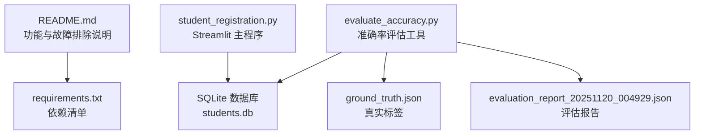
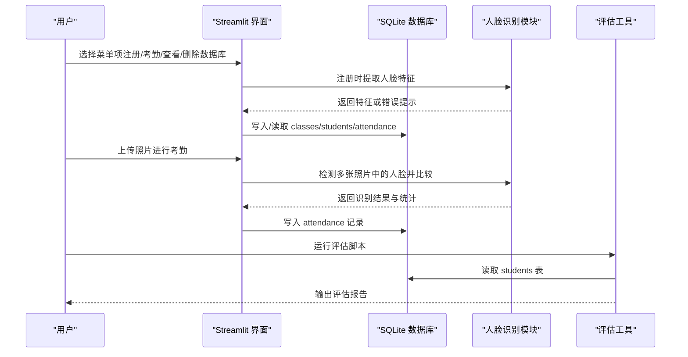
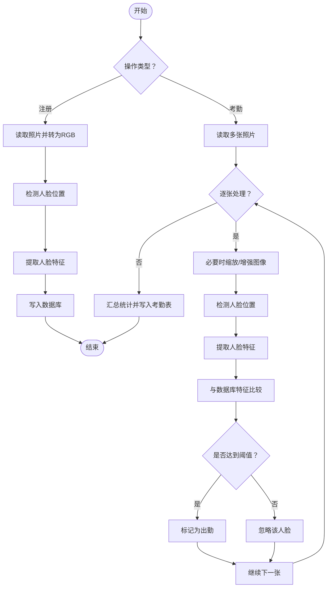
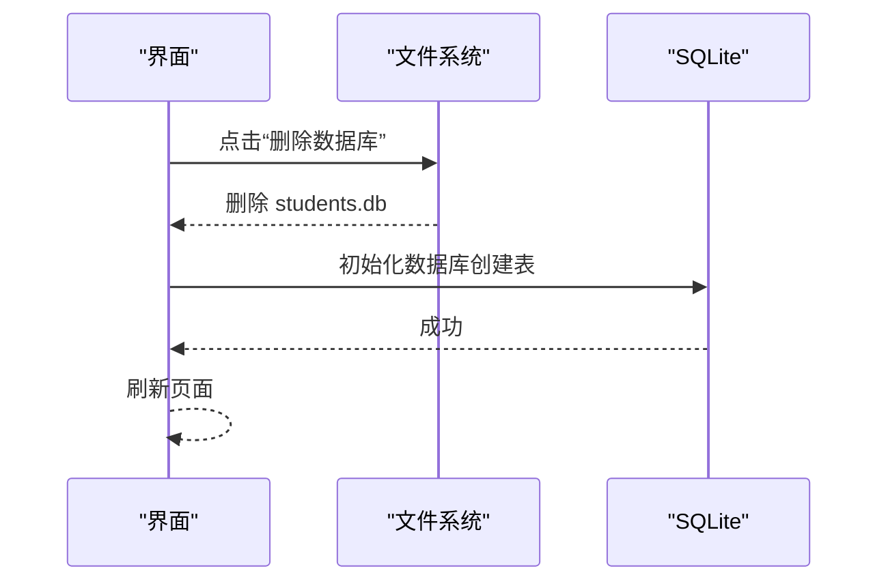
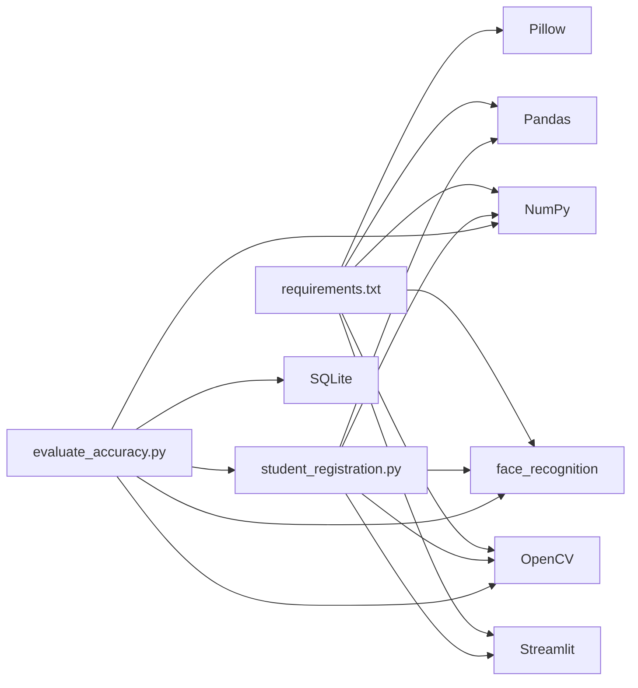

# 常见问题

<cite>
**本文引用的文件**
- [README.md](file://README.md)
- [requirements.txt](file://requirements.txt)
- [student_registration.py](file://student_registration.py)
- [evaluate_accuracy.py](file://evaluate_accuracy.py)
- [evaluation_report_20251120_004929.json](file://evaluation_report_20251120_004929.json)
- [ground_truth.json](file://ground_truth.json)
</cite>

## 目录
1. [简介](#简介)
2. [项目结构](#项目结构)
3. [核心组件](#核心组件)
4. [架构总览](#架构总览)
5. [详细组件分析](#详细组件分析)
6. [依赖关系分析](#依赖关系分析)
7. [性能考虑](#性能考虑)
8. [故障排除指南](#故障排除指南)
9. [结论](#结论)
10. [附录](#附录)

## 简介
本指南面向使用 SmartAttend 人脸识别考勤系统的用户，围绕“人脸识别问题”和“数据库问题”两大类，系统性梳理常见问题及解决方案。同时补充 README 中未详述的潜在问题，如依赖包冲突与 Streamlit 界面加载缓慢等，并提供可操作的排查策略。

## 项目结构
- 应用入口为 Streamlit 页面，负责学生注册、考勤标记、考勤查看与数据库管理等。
- 数据存储采用 SQLite 文件，包含 classes、students、attendance 三张表。
- 评估模块提供离线准确率评估工具，便于验证识别效果。

图表来源
- [README.md](file://README.md#L1-L127)
- [requirements.txt](file://requirements.txt#L1-L6)
- [student_registration.py](file://student_registration.py#L1-L120)
- [evaluate_accuracy.py](file://evaluate_accuracy.py#L1-L60)
- [ground_truth.json](file://ground_truth.json#L1-L11)
- [evaluation_report_20251120_004929.json](file://evaluation_report_20251120_004929.json#L1-L40)

章节来源
- [README.md](file://README.md#L1-L127)
- [requirements.txt](file://requirements.txt#L1-L6)
- [student_registration.py](file://student_registration.py#L1-L120)
- [evaluate_accuracy.py](file://evaluate_accuracy.py#L1-L60)
- [ground_truth.json](file://ground_truth.json#L1-L11)
- [evaluation_report_20251120_004929.json](file://evaluation_report_20251120_004929.json#L1-L40)

## 核心组件
- Streamlit 界面与菜单：提供“注册学生、列出学生、更新学生、删除学生、查询详情、考勤打卡、查看考勤、删除数据库”等操作入口。
- 数据库初始化与校验：启动时自动创建 classes、students、attendance 表；支持“删除数据库”后自动重建。
- 人脸识别流程：注册阶段提取单张人脸特征；考勤阶段检测多张照片中的人脸并进行相似度比较，自动标记出勤。
- 评估工具：基于 ground_truth.json 对测试照片进行识别评估，输出精确率、召回率、F1、准确率等指标，并生成评估报告。

章节来源
- [student_registration.py](file://student_registration.py#L1-L120)
- [student_registration.py](file://student_registration.py#L836-L1005)
- [evaluate_accuracy.py](file://evaluate_accuracy.py#L1-L120)
- [README.md](file://README.md#L30-L41)

## 架构总览
下图展示从用户操作到数据库与人脸识别模块的交互路径。

图表来源
- [student_registration.py](file://student_registration.py#L120-L220)
- [student_registration.py](file://student_registration.py#L489-L700)
- [evaluate_accuracy.py](file://evaluate_accuracy.py#L1-L120)
- [README.md](file://README.md#L30-L41)

## 详细组件分析

### 人脸识别流程（注册与考勤）
- 注册阶段：将上传照片转换为 RGB，使用人脸检测模型定位人脸，提取 128 维特征并存入数据库。
- 考勤阶段：对每张照片进行人脸检测与特征提取，与数据库中存储的特征逐一比较，设定相似度阈值，自动标记出勤。

图表来源
- [student_registration.py](file://student_registration.py#L57-L127)
- [student_registration.py](file://student_registration.py#L489-L700)
- [evaluate_accuracy.py](file://evaluate_accuracy.py#L60-L120)

章节来源
- [student_registration.py](file://student_registration.py#L57-L127)
- [student_registration.py](file://student_registration.py#L489-L700)
- [evaluate_accuracy.py](file://evaluate_accuracy.py#L60-L120)

### 数据库初始化与重建
- 启动时自动创建 classes、students、attendance 表；students 表包含人脸特征字段，attendance 表记录日期、节次与状态。
- “删除数据库”选项会移除 students.db 并调用初始化函数重建表结构。

图表来源
- [student_registration.py](file://student_registration.py#L18-L53)
- [student_registration.py](file://student_registration.py#L994-L1005)

章节来源
- [student_registration.py](file://student_registration.py#L18-L53)
- [student_registration.py](file://student_registration.py#L994-L1005)

## 依赖关系分析
- Streamlit、OpenCV、face_recognition、Pillow、NumPy、Pandas 为主要依赖。
- 人脸识别模块依赖 OpenCV 的级联分类器与 face_recognition 的特征提取与距离计算。
- 评估工具依赖 SQLite 读取注册学生特征，结合 ground_truth.json 进行指标计算。

图表来源
- [requirements.txt](file://requirements.txt#L1-L6)
- [student_registration.py](file://student_registration.py#L1-L20)
- [evaluate_accuracy.py](file://evaluate_accuracy.py#L1-L30)

章节来源
- [requirements.txt](file://requirements.txt#L1-L6)
- [student_registration.py](file://student_registration.py#L1-L20)
- [evaluate_accuracy.py](file://evaluate_accuracy.py#L1-L30)

## 性能考虑
- 处理大图时会进行缩放以提升速度，避免内存与计算压力。
- 考勤阶段默认阈值略低于文档描述，有助于在复杂场景下提升识别召回率。
- 评估工具提供阈值调节与指标输出，便于针对性优化。

章节来源
- [student_registration.py](file://student_registration.py#L532-L540)
- [student_registration.py](file://student_registration.py#L574-L576)
- [evaluate_accuracy.py](file://evaluate_accuracy.py#L25-L35)

## 故障排除指南

### 人脸识别问题
- 光照条件不佳
  - 现象：注册照片或课堂照片中人脸不可见或特征提取失败。
  - 解决：确保拍摄环境光线均匀、充足；避免逆光或强光直射；尽量在室内自然光环境下拍照。
  - 参考实现：系统会在检测不到人脸时尝试图像增强与不同模型检测，仍失败时给出建议。
  
  章节来源
  - [student_registration.py](file://student_registration.py#L83-L127)
  - [README.md](file://README.md#L103-L108)

- 照片质量差
  - 现象：人脸模糊、像素过低、被遮挡或角度过大导致无法识别。
  - 解决：使用高分辨率照片，确保人脸完整出现在画面中；避免低头、仰头、侧脸或背光拍摄；尽量正面对镜头。
  - 参考实现：注册阶段若未检测到人脸会提示“请使用更清晰的照片”。

  章节来源
  - [student_registration.py](file://student_registration.py#L254-L281)
  - [README.md](file://README.md#L103-L108)

- 人脸角度与姿态
  - 现象：极端角度或侧脸导致特征提取困难。
  - 解决：要求正面拍摄，头部保持稳定；避免过大的俯仰角或偏转角。
  - 参考实现：考勤阶段会尝试 HOG/CNN 模型与图像增强，仍无法检测时给出建议。

  章节来源
  - [student_registration.py](file://student_registration.py#L83-L127)
  - [README.md](file://README.md#L103-L108)

- 识别阈值与误判/漏判
  - 现象：注册照片与课堂照片差异较大，或阈值设置影响识别效果。
  - 解决：使用评估工具调节阈值并观察精确率/召回率/F1；根据班级实际情况平衡误判与漏判。
  - 参考实现：评估工具内置阈值与指标计算逻辑。

  章节来源
  - [evaluate_accuracy.py](file://evaluate_accuracy.py#L25-L35)
  - [evaluation_report_20251120_004929.json](file://evaluation_report_20251120_004929.json#L1-L20)

### 数据库问题
- 数据库损坏或结构异常
  - 现象：启动时报错或功能异常。
  - 解决：使用“删除数据库”选项重置系统。系统会自动删除 students.db 并重建 classes、students、attendance 表结构。
  - 参考实现：删除后调用初始化函数重建表，再刷新页面。

  章节来源
  - [student_registration.py](file://student_registration.py#L994-L1005)
  - [student_registration.py](file://student_registration.py#L18-L53)
  - [README.md](file://README.md#L109-L112)

- 数据库为空或首次使用
  - 现象：提示数据库为空，等待首次注册学生。
  - 解决：先创建班级，再注册学生，最后进行考勤打卡。

  章节来源
  - [student_registration.py](file://student_registration.py#L156-L178)
  - [student_registration.py](file://student_registration.py#L836-L860)

### 依赖包冲突与版本问题
- 现象：运行报错或模块导入失败。
- 解决：严格按 requirements.txt 安装依赖；若出现冲突，优先使用虚拟环境隔离；确保 Python 版本满足要求。
- 参考实现：依赖清单明确列出各库版本。

章节来源
- [requirements.txt](file://requirements.txt#L1-L6)
- [README.md](file://README.md#L42-L47)

### Streamlit 界面加载缓慢
- 现象：页面打开慢、按钮点击响应迟缓。
- 解决：检查本地网络与浏览器缓存；关闭不必要的后台应用释放资源；重启应用；适当减少一次性上传的照片数量；确保系统资源充足。

章节来源
- [README.md](file://README.md#L61-L76)

### 其他潜在问题与建议
- 人脸检测模型切换：系统会优先尝试 HOG 模型，若未检测到则回退 CNN 模型；若仍失败，会进行图像增强尝试。
- 图像缩放：为提升处理速度，系统会对超大图像进行缩放。
- 评估辅助：使用 ground_truth.json 与 evaluate_accuracy.py 生成评估报告，指导阈值与流程优化。

章节来源
- [student_registration.py](file://student_registration.py#L83-L127)
- [student_registration.py](file://student_registration.py#L532-L540)
- [evaluate_accuracy.py](file://evaluate_accuracy.py#L1-L60)
- [ground_truth.json](file://ground_truth.json#L1-L11)
- [evaluation_report_20251120_004929.json](file://evaluation_report_20251120_004929.json#L1-L40)

## 结论
通过本指南，用户可以快速定位并解决人脸识别与数据库相关问题。建议在日常使用中：
- 重视光照与照片质量，确保正面、清晰的人脸；
- 使用“删除数据库”选项快速恢复系统；
- 利用评估工具持续优化识别阈值与流程；
- 注意依赖版本与运行环境，避免冲突与性能问题。

## 附录
- 评估报告解读要点
  - 整体指标：精确率、召回率、F1、准确率；
  - 细分统计：每张照片的 TP/FP/FN 与对应指标；
  - 报告文件命名含时间戳，便于版本对比。

章节来源
- [evaluation_report_20251120_004929.json](file://evaluation_report_20251120_004929.json#L1-L40)
- [evaluate_accuracy.py](file://evaluate_accuracy.py#L170-L214)