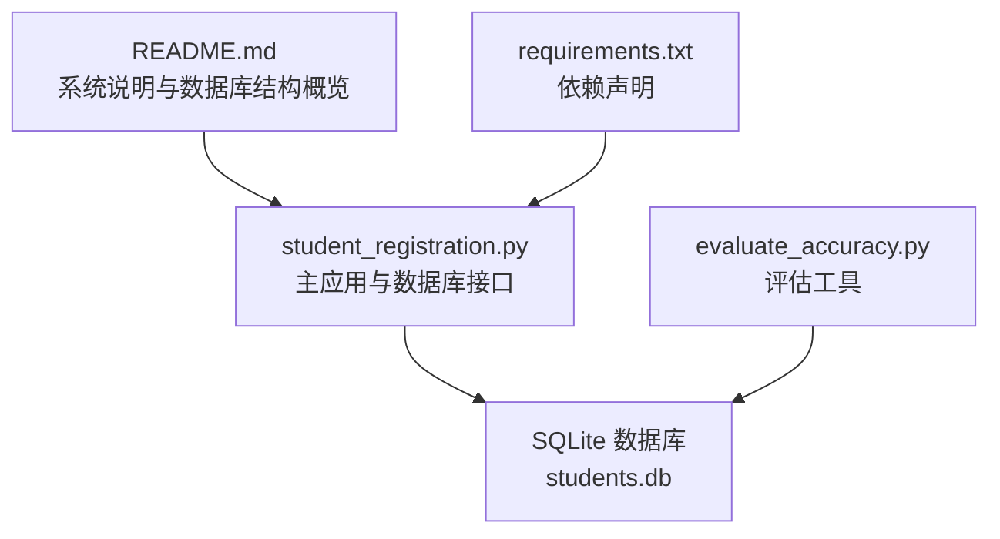
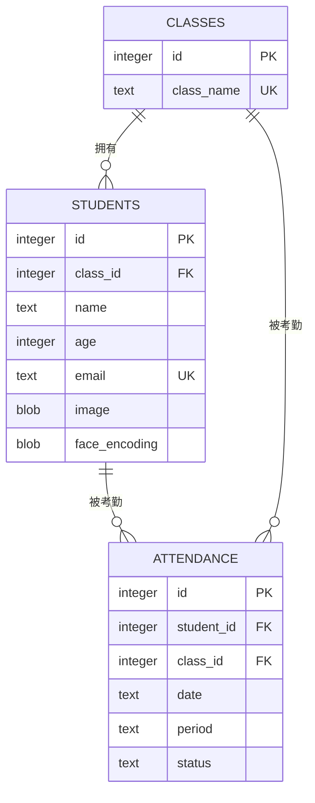
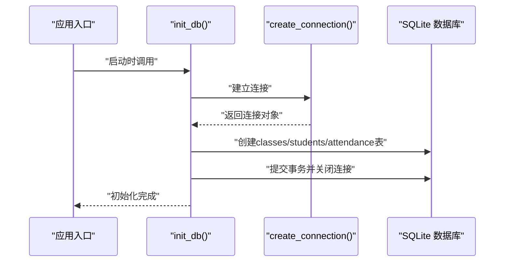
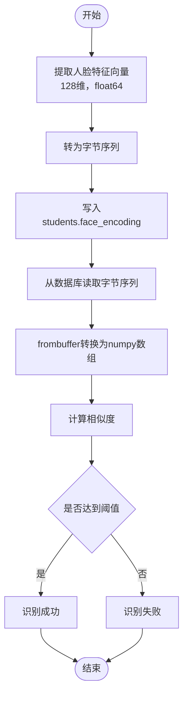
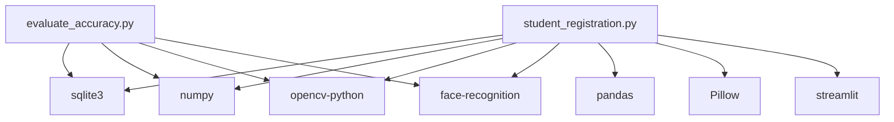

# 数据库设计

<cite>
**本文引用的文件**
- [README.md](file://README.md)
- [student_registration.py](file://student_registration.py)
- [evaluate_accuracy.py](file://evaluate_accuracy.py)
- [requirements.txt](file://requirements.txt)
</cite>

## 目录
1. [简介](#简介)
2. [项目结构](#项目结构)
3. [核心组件](#核心组件)
4. [架构总览](#架构总览)
5. [详细组件分析](#详细组件分析)
6. [依赖分析](#依赖分析)
7. [性能考虑](#性能考虑)
8. [故障排查指南](#故障排查指南)
9. [结论](#结论)
10. [附录](#附录)

## 简介
本文件面向数据库设计与实现，围绕系统使用的SQLite数据库三张核心表：classes、students、attendance，给出完整的设计文档。内容涵盖：
- 表结构与字段定义、数据类型、主键/外键约束与索引策略
- 表间关系与参照完整性
- 数据生命周期与业务规则（如按日期与节次存储考勤）
- 数据库初始化与连接管理的实现要点
- 面向人脸识别特征存储的特殊字段设计说明（students表的face_encoding字段以BLOB存储128维numpy数组的字节数据）

## 项目结构
本仓库采用“功能模块化+单一入口”的组织方式：
- 主应用入口：student_registration.py，负责数据库初始化、连接管理、业务接口（增删改查、考勤标记、考勤视图等）
- 评估工具：evaluate_accuracy.py，基于同一数据库进行识别准确率评估
- 文档与依赖：README.md、requirements.txt

图表来源
- [student_registration.py](file://student_registration.py#L1-L120)
- [evaluate_accuracy.py](file://evaluate_accuracy.py#L1-L40)
- [README.md](file://README.md#L36-L41)

章节来源
- [README.md](file://README.md#L36-L41)
- [student_registration.py](file://student_registration.py#L1-L120)
- [evaluate_accuracy.py](file://evaluate_accuracy.py#L1-L40)
- [requirements.txt](file://requirements.txt#L1-L6)

## 核心组件
本系统使用SQLite数据库，核心表如下：
- classes：存储班级信息
- students：存储学生信息及人脸特征
- attendance：记录考勤明细（按日期与节次聚合）

数据库初始化与连接管理：
- 初始化：init_db函数在应用启动时创建三张表，并设置唯一性与外键约束
- 连接管理：create_connection函数统一建立数据库连接；verify_database用于验证数据库结构存在性
- 评估工具：AccuracyEvaluator类直接连接students.db，读取students表进行识别评估

章节来源
- [student_registration.py](file://student_registration.py#L18-L53)
- [student_registration.py](file://student_registration.py#L147-L178)
- [student_registration.py](file://student_registration.py#L227-L241)
- [evaluate_accuracy.py](file://evaluate_accuracy.py#L25-L35)

## 架构总览
下图展示三张核心表的结构与关系，以及应用层与数据库层的交互。

图表来源
- [student_registration.py](file://student_registration.py#L24-L48)
- [student_registration.py](file://student_registration.py#L227-L241)

章节来源
- [student_registration.py](file://student_registration.py#L24-L48)
- [student_registration.py](file://student_registration.py#L227-L241)

## 详细组件分析

### classes 表
- 字段定义
  - id：整型，自增主键
  - class_name：文本，唯一且非空
- 约束与索引
  - 主键：id
  - 唯一约束：class_name
  - 无显式索引（可通过唯一约束隐含索引）
- 用途
  - 作为学生与考勤记录的归属单位，提供班级维度的数据隔离

章节来源
- [student_registration.py](file://student_registration.py#L24-L33)

### students 表
- 字段定义
  - id：整型，自增主键
  - class_id：整型，非空，外键引用classes.id
  - name：文本，非空
  - age：整型，非空
  - email：文本，唯一且非空
  - image：二进制大对象，存储学生照片
  - face_encoding：二进制大对象，存储128维人脸特征向量的字节序列
- 约束与索引
  - 主键：id
  - 唯一约束：email
  - 外键约束：class_id -> classes.id
  - 无显式索引（建议按class_id与email建立索引以提升查询效率）
- 特殊字段说明：face_encoding
  - 以BLOB类型存储numpy数组的字节数据，数组dtype为float64，维度为128
  - 写入时将numpy数组转为bytes；读取时使用frombuffer转换回numpy数组进行比较
- 业务用途
  - 存储学生基本信息与人脸特征，支撑考勤识别与身份核验

章节来源
- [student_registration.py](file://student_registration.py#L29-L37)
- [student_registration.py](file://student_registration.py#L128-L146)
- [student_registration.py](file://student_registration.py#L254-L278)
- [evaluate_accuracy.py](file://evaluate_accuracy.py#L80-L96)

### attendance 表
- 字段定义
  - id：整型，自增主键
  - student_id：整型，非空，外键引用students.id
  - class_id：整型，非空，外键引用classes.id
  - date：文本，非空，存储“YYYY-MM-DD”格式的日期
  - period：文本，非空，存储节次标识（如“1”、“2”等）
  - status：文本，非空，存储“Present”或“Absent”
- 约束与索引
  - 主键：id
  - 外键约束：student_id -> students.id；class_id -> classes.id
  - 无显式索引（建议按date、period、status组合建立复合索引以优化考勤统计与查询）
- 数据生命周期
  - 每日按节次生成一条记录，若同一天同一节次重复提交则忽略（由业务逻辑保证唯一性）
  - 支持按日期与节次聚合统计，形成每日、每节的出勤报表

章节来源
- [student_registration.py](file://student_registration.py#L40-L48)
- [student_registration.py](file://student_registration.py#L489-L683)
- [student_registration.py](file://student_registration.py#L684-L835)

### 表间关系与参照完整性
- students.class_id → classes.id
- attendance.student_id → students.id
- attendance.class_id → classes.id
- 业务层面：attendance记录必须与students与classes在同属一个班级的前提下建立关联，确保数据一致性

章节来源
- [student_registration.py](file://student_registration.py#L29-L37)
- [student_registration.py](file://student_registration.py#L40-L48)

### 数据库初始化与连接管理
- 初始化流程（init_db）
  - 建立数据库连接
  - 创建classes表（含唯一约束）
  - 创建students表（含唯一约束与外键约束）
  - 创建attendance表（含外键约束）
  - 提交事务并关闭连接
- 连接管理（create_connection）
  - 统一返回sqlite3连接对象，异常时返回None并提示错误
- 结构校验（verify_database）
  - 检查sqlite_master是否存在表，为空时提示首次初始化
- 评估工具连接
  - AccuracyEvaluator直接连接students.db，读取students表进行识别评估

图表来源
- [student_registration.py](file://student_registration.py#L18-L53)
- [student_registration.py](file://student_registration.py#L147-L178)

章节来源
- [student_registration.py](file://student_registration.py#L18-L53)
- [student_registration.py](file://student_registration.py#L147-L178)
- [student_registration.py](file://student_registration.py#L227-L241)
- [evaluate_accuracy.py](file://evaluate_accuracy.py#L25-L35)

### 人脸识别特征存储与比较流程
- 写入流程
  - 读取上传照片，提取人脸特征向量（128维，float64）
  - 将numpy数组转为bytes写入students.face_encoding
- 读取与比较流程
  - 从数据库读取face_encoding字节流，使用frombuffer转换为numpy数组
  - 使用face_recognition库计算欧氏距离并转换为相似度，与阈值比较判定识别结果

图表来源
- [student_registration.py](file://student_registration.py#L254-L278)
- [student_registration.py](file://student_registration.py#L128-L146)
- [evaluate_accuracy.py](file://evaluate_accuracy.py#L80-L96)

章节来源
- [student_registration.py](file://student_registration.py#L254-L278)
- [student_registration.py](file://student_registration.py#L128-L146)
- [evaluate_accuracy.py](file://evaluate_accuracy.py#L80-L96)

## 依赖分析
- 应用层依赖
  - sqlite3：数据库访问
  - numpy：人脸特征向量的数值运算与字节转换
  - opencv-python：图像预处理与人脸检测
  - face-recognition：人脸特征提取与距离计算
  - pandas：考勤统计与表格展示
  - Pillow：图像解码与显示
  - streamlit：Web界面与用户交互
- 评估工具依赖
  - 与主应用相同的底层库，用于离线评估识别效果

图表来源
- [requirements.txt](file://requirements.txt#L1-L6)
- [student_registration.py](file://student_registration.py#L1-L17)
- [evaluate_accuracy.py](file://evaluate_accuracy.py#L17-L24)

章节来源
- [requirements.txt](file://requirements.txt#L1-L6)
- [student_registration.py](file://student_registration.py#L1-L17)
- [evaluate_accuracy.py](file://evaluate_accuracy.py#L17-L24)

## 性能考虑
- 索引建议
  - students：class_id、email（唯一）
  - attendance：date、period、status（组合索引），student_id、class_id（外键索引）
- 查询优化
  - 考勤视图与统计应尽量使用索引覆盖的WHERE条件
  - 大批量插入attendance时建议使用事务批量提交
- 存储优化
  - face_encoding为float64，占用空间较大；可考虑压缩或量化（需权衡精度与性能）
- I/O优化
  - 图像解码与人脸检测在CPU上进行，建议控制并发与输入尺寸，避免超大图片导致延迟

[本节为通用性能建议，不直接分析具体文件]

## 故障排查指南
- 数据库连接失败
  - 检查create_connection返回值是否为None，确认数据库文件权限与路径
- 数据库结构缺失
  - 使用verify_database检查sqlite_master是否存在表；必要时删除students.db并重新初始化
- 唯一性冲突
  - email唯一冲突会触发IntegrityError；请更换邮箱或清理重复数据
- 考勤重复记录
  - 业务逻辑已在同一天同一节次避免重复插入；若出现重复，检查日期与节次参数是否一致
- 人脸识别失败
  - 检查照片质量、光照与角度；必要时调整阈值或增强图像

章节来源
- [student_registration.py](file://student_registration.py#L147-L178)
- [student_registration.py](file://student_registration.py#L232-L240)
- [student_registration.py](file://student_registration.py#L603-L621)
- [README.md](file://README.md#L109-L112)

## 结论
本数据库设计围绕“班级-学生-考勤”三层关系展开，采用SQLite轻量部署、BLOB存储人脸特征向量的方式满足人脸识别场景需求。通过外键约束保障参照完整性，结合业务层的唯一性与幂等逻辑，实现了稳定的考勤数据生命周期管理。建议后续根据查询热点补充索引、优化I/O与存储策略，以进一步提升系统性能与可维护性。

[本节为总结性内容，不直接分析具体文件]

## 附录

### 表结构与字段定义一览
- classes
  - id：整型，自增主键
  - class_name：文本，唯一且非空
- students
  - id：整型，自增主键
  - class_id：整型，非空，外键
  - name：文本，非空
  - age：整型，非空
  - email：文本，唯一且非空
  - image：二进制大对象
  - face_encoding：二进制大对象（128维float64向量的字节序列）
- attendance
  - id：整型，自增主键
  - student_id：整型，非空，外键
  - class_id：整型，非空，外键
  - date：文本，非空（YYYY-MM-DD）
  - period：文本，非空（节次标识）
  - status：文本，非空（Present/Absent）

章节来源
- [student_registration.py](file://student_registration.py#L24-L48)
- [student_registration.py](file://student_registration.py#L254-L278)
- [student_registration.py](file://student_registration.py#L489-L683)