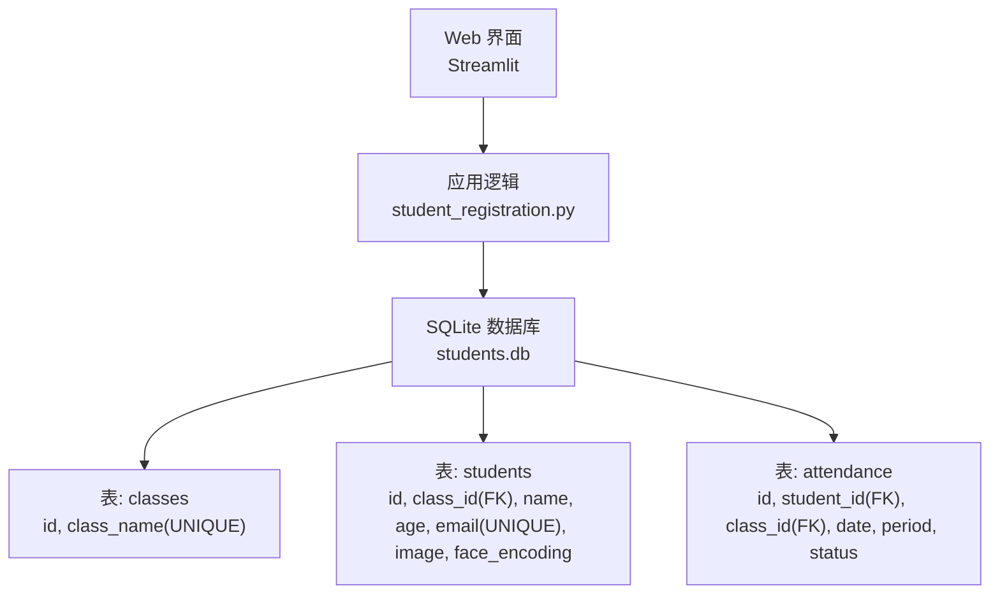
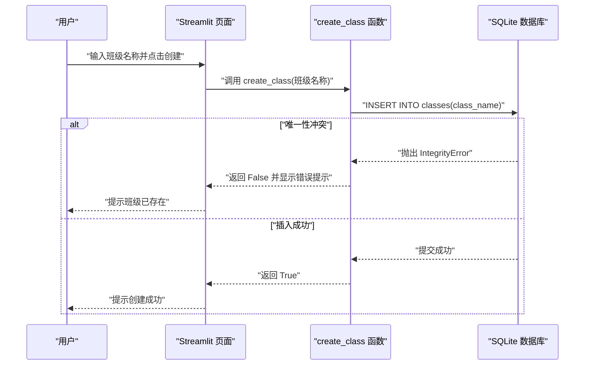

# 班级管理

<cite>
**本文引用的文件**
- [README.md](file://README.md)
- [student_registration.py](file://student_registration.py)
- [requirements.txt](file://requirements.txt)
</cite>

## 目录
1. [简介](#简介)
2. [项目结构](#项目结构)
3. [核心组件](#核心组件)
4. [架构总览](#架构总览)
5. [详细组件分析](#详细组件分析)
6. [依赖分析](#依赖分析)
7. [性能考虑](#性能考虑)
8. [故障排查指南](#故障排查指南)
9. [结论](#结论)
10. [附录](#附录)

## 简介
本文件围绕“班级管理”功能展开，重点解释以下内容：
- create_class 与 get_all_classes 函数的实现细节及其与 SQLite 数据库中 classes 表的交互方式
- 用户如何通过 Web 界面创建新班级，并确保班级名称的唯一性
- 在学生注册与考勤打卡前必须先选择班级的逻辑
- 如何调用 create_class 并处理 IntegrityError 异常
- 数据库中 class_id 作为外键在 students 与 attendance 表中的作用，以实现数据隔离
- 常见问题与解决方案，如重复班级名称导致的错误处理

## 项目结构
该项目采用单文件 Web 应用（Streamlit）+ 本地 SQLite 数据库的轻量架构。核心业务逻辑集中在 student_registration.py 中，数据库初始化、表结构定义与 Web 界面入口均在此文件内完成。

图表来源
- [student_registration.py](file://student_registration.py#L18-L53)
- [student_registration.py](file://student_registration.py#L226-L253)
- [student_registration.py](file://student_registration.py#L836-L860)

章节来源
- [README.md](file://README.md#L36-L41)
- [student_registration.py](file://student_registration.py#L18-L53)

## 核心组件
- 数据库初始化与表结构
  - 初始化函数负责创建 classes、students、attendance 三张表，并设置外键约束与唯一性约束。
  - classes 表包含 id 与 class_name；students 表包含 class_id 外键；attendance 表包含 student_id 与 class_id 外键。
- 班级管理函数
  - create_class：向 classes 表插入一条记录，class_name 唯一性由数据库约束保证。
  - get_all_classes：查询 classes 表返回 id 与 class_name 列表。
- Web 界面入口
  - 应用启动时验证数据库结构，随后拉取所有班级并提供下拉选择；若无班级则提示输入新班级名并创建。

章节来源
- [student_registration.py](file://student_registration.py#L18-L53)
- [student_registration.py](file://student_registration.py#L226-L253)
- [student_registration.py](file://student_registration.py#L836-L860)

## 架构总览
下面的序列图展示了 Web 界面创建班级的完整流程，包括用户输入、后端校验与数据库写入，以及 IntegrityError 的捕获与反馈。

图表来源
- [student_registration.py](file://student_registration.py#L226-L241)
- [student_registration.py](file://student_registration.py#L843-L855)

## 详细组件分析

### create_class 函数
- 功能概述
  - 将传入的班级名称写入 classes 表的 class_name 字段。
  - 由于 class_name 设为 UNIQUE，重复插入会触发 IntegrityError。
- 实现要点
  - 使用 sqlite3 连接 students.db，执行插入语句。
  - 捕获 IntegrityError 并输出友好提示；其他异常统一处理。
- 调用示例路径
  - Web 界面入口处，当用户输入新班级名并点击按钮时，调用 create_class 并根据返回值刷新页面或提示错误。
- 错误处理
  - IntegrityError：提示“班级已存在”，避免重复创建。
  - 其他异常：统一输出错误信息，防止应用崩溃。

章节来源
- [student_registration.py](file://student_registration.py#L226-L241)
- [student_registration.py](file://student_registration.py#L843-L855)

### get_all_classes 函数
- 功能概述
  - 查询 classes 表，返回 id 与 class_name 的元组列表，供前端下拉选择使用。
- 实现要点
  - 使用 sqlite3 连接 students.db，执行 SELECT 查询。
  - 捕获异常并返回空列表，避免前端报错。
- 使用场景
  - 应用启动时拉取所有班级，构建“选择班级”的选项。
  - 当无班级时，引导用户先创建班级。

章节来源
- [student_registration.py](file://student_registration.py#L242-L253)
- [student_registration.py](file://student_registration.py#L843-L855)

### Web 界面创建班级流程
- 流程说明
  - 若当前无班级，页面提示“请先创建班级”，用户输入新班级名并点击“创建”。
  - create_class 返回 True 时提示创建成功并刷新页面；返回 False 时提示“班级已存在”。
- 关键点
  - 选择班级是后续所有操作的前提，未选择班级时无法进行学生注册与考勤打卡。

章节来源
- [student_registration.py](file://student_registration.py#L843-L855)

### 数据库外键与数据隔离
- 外键关系
  - students.class_id -> classes.id
  - attendance.student_id -> students.id
  - attendance.class_id -> classes.id
- 数据隔离效果
  - 通过外键约束，确保：
    - 学生必须属于某个已存在的班级；
    - 考勤记录必须关联到具体学生与班级；
    - 删除班级或学生时，需遵循外键约束，避免悬挂引用。
- 业务意义
  - 防止跨班级数据污染；
  - 保障统计与查询的准确性（如按班级维度查看考勤）。

章节来源
- [student_registration.py](file://student_registration.py#L28-L48)

### 学生注册与考勤打卡前必须选择班级的逻辑
- 选择班级
  - 应用启动后立即拉取所有班级并生成下拉菜单；若无班级则提示先创建。
- 学生注册
  - 注册接口接收 class_id 参数，将学生绑定到指定班级。
- 考勤打卡
  - 考勤接口接收 class_id，仅对该班级的学生进行识别与记录。
- 未选择班级的后果
  - 若未选择班级，注册与考勤操作将无法执行或产生错误提示。

章节来源
- [student_registration.py](file://student_registration.py#L843-L860)
- [student_registration.py](file://student_registration.py#L254-L281)
- [student_registration.py](file://student_registration.py#L489-L502)

### 如何调用 create_class 并处理 IntegrityError
- 调用方式
  - 在 Web 界面中，用户输入班级名后点击“创建”，页面逻辑调用 create_class 并根据返回值进行提示与刷新。
- 异常处理
  - 当 class_name 重复时，数据库抛出 IntegrityError，create_class 捕获并提示“班级已存在”。
- 参考路径
  - create_class 定义与异常处理
  - Web 界面创建按钮与提示逻辑

章节来源
- [student_registration.py](file://student_registration.py#L226-L241)
- [student_registration.py](file://student_registration.py#L843-L855)

### 班级名称唯一性的保障机制
- 数据库层面
  - classes.class_name 设置为 UNIQUE，任何重复插入都会触发 IntegrityError。
- 应用层面
  - create_class 捕获 IntegrityError 并给出明确提示，避免用户误以为操作失败。
- 前端提示
  - 当 IntegrityError 发生时，页面显示“班级已存在”，引导用户更换名称或直接选择已有班级。

章节来源
- [student_registration.py](file://student_registration.py#L226-L241)
- [student_registration.py](file://student_registration.py#L843-L855)

## 依赖分析
- 外部依赖
  - Streamlit：提供 Web 界面与交互能力
  - OpenCV：图像处理与人脸检测
  - face_recognition：人脸编码与相似度比较
  - Pillow：图像读写
  - NumPy：数值计算
- 内部模块
  - student_registration.py：包含数据库初始化、班级管理、学生管理、考勤管理等全部业务逻辑

章节来源
- [requirements.txt](file://requirements.txt#L1-L6)
- [student_registration.py](file://student_registration.py#L1-L17)

## 性能考虑
- 人脸识别与相似度计算
  - 对于多张照片与大量学生，识别过程可能较慢；建议控制单次上传数量与照片分辨率。
- 数据库访问
  - 所有数据库操作均在本地 SQLite 上执行，适合中小规模数据；大规模并发场景建议迁移到更健壮的数据库。
- 前端渲染
  - 学生列表与考勤表格采用 Streamlit 组件，注意数据量过大时的渲染性能。

## 故障排查指南
- “班级已存在”
  - 现象：创建班级时报错“班级已存在”
  - 原因：class_name 唯一性冲突
  - 处理：更换班级名称或直接选择已有班级
- “数据库错误”
  - 现象：初始化或查询时出现数据库错误
  - 处理：使用“删除数据库”选项重置，系统将自动重建表结构
- “未检测到人脸”
  - 现象：注册或考勤时提示未检测到人脸
  - 处理：改善光照条件、确保正面清晰、提高照片分辨率、避免极端角度

章节来源
- [student_registration.py](file://student_registration.py#L226-L241)
- [student_registration.py](file://student_registration.py#L100-L126)
- [README.md](file://README.md#L109-L112)

## 结论
本项目通过 SQLite 与 Streamlit 实现了完整的班级管理与考勤流程。create_class 与 get_all_classes 两个核心函数分别承担“创建班级”与“查询班级”的职责，配合数据库的 UNIQUE 与外键约束，有效保障了数据一致性与业务正确性。Web 界面强制要求先选择班级，确保后续学生注册与考勤打卡的上下文一致。对于重复班级名等常见问题，应用提供了明确的错误提示与处理路径。

## 附录
- 数据库表结构概览
  - classes：id（主键）、class_name（唯一）
  - students：id（主键）、class_id（外键指向 classes.id）、name、age、email（唯一）、image、face_encoding
  - attendance：id（主键）、student_id（外键指向 students.id）、class_id（外键指向 classes.id）、date、period、status

章节来源
- [student_registration.py](file://student_registration.py#L22-L48)
- [README.md](file://README.md#L36-L41)