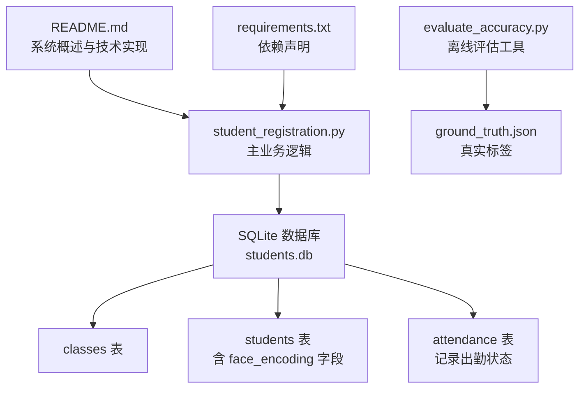
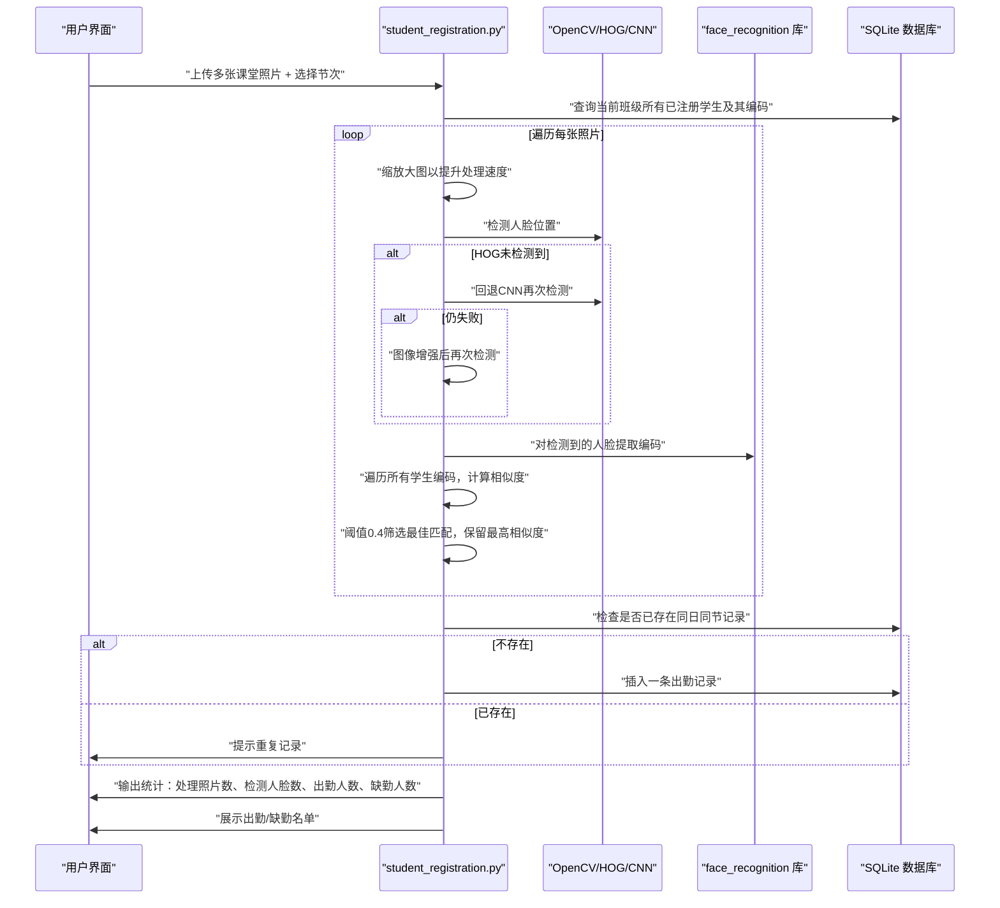
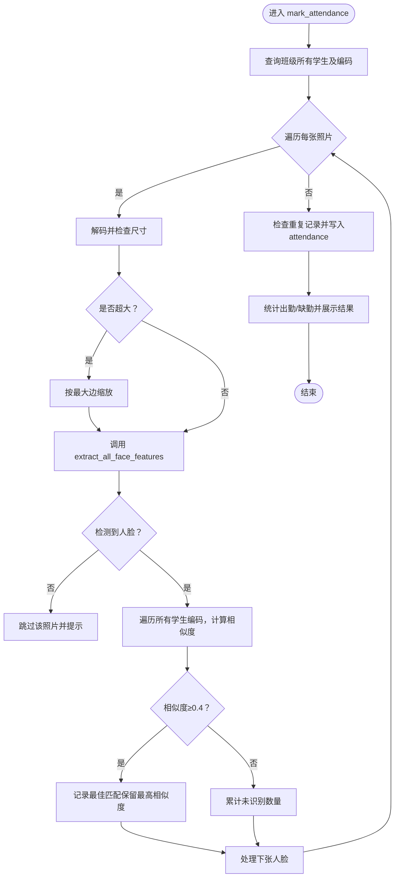
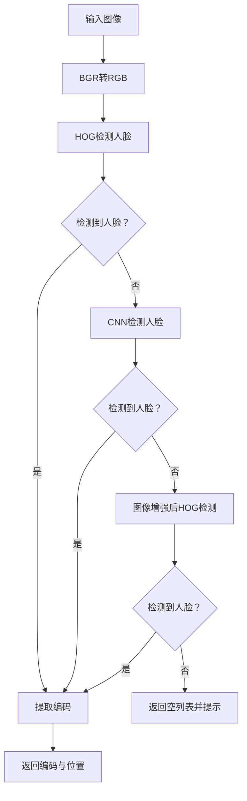
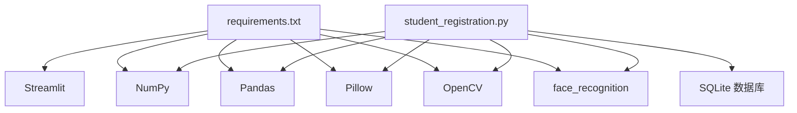

# 考勤打卡

<cite>
**本文引用的文件**
- [README.md](file://README.md)
- [student_registration.py](file://student_registration.py)
- [evaluate_accuracy.py](file://evaluate_accuracy.py)
- [requirements.txt](file://requirements.txt)
- [ground_truth.json](file://ground_truth.json)
</cite>

## 目录
1. [简介](#简介)
2. [项目结构](#项目结构)
3. [核心组件](#核心组件)
4. [架构总览](#架构总览)
5. [详细组件分析](#详细组件分析)
6. [依赖关系分析](#依赖关系分析)
7. [性能考量](#性能考量)
8. [故障排查指南](#故障排查指南)
9. [结论](#结论)
10. [附录](#附录)

## 简介
本文件围绕“考勤打卡”功能展开，重点解析 mark_attendance 函数的完整流程：从多张上传的课堂照片入手，利用 HOG 和 CNN 模型进行人脸检测与编码提取；随后将检测到的人脸编码与数据库中所有已注册学生的编码进行相似度比对，采用欧几里得距离计算相似度并以 0.4 的阈值进行匹配；系统通过避免重复标记确保每名学生在同一节课仅记录一次出勤；最终生成详细的考勤统计，包括出勤与缺勤名单，并将结果写入 attendance 表。文档还提供数据流的逐步分析、性能优化建议以及识别失败时的用户提示策略。

## 项目结构
该项目采用单文件 Streamlit 应用作为前端入口，配合 SQLite 数据库存储结构化数据。核心逻辑集中在 student_registration.py 中，包含数据库初始化、人脸特征提取、考勤标记、考勤查看等模块；evaluate_accuracy.py 提供离线评估工具，用于评估识别准确率；requirements.txt 定义运行依赖；README.md 提供系统概述与使用说明。

图表来源
- [README.md](file://README.md#L28-L41)
- [student_registration.py](file://student_registration.py#L19-L49)
- [evaluate_accuracy.py](file://evaluate_accuracy.py#L1-L20)
- [requirements.txt](file://requirements.txt#L1-L6)

章节来源
- [README.md](file://README.md#L1-L127)
- [student_registration.py](file://student_registration.py#L1-L120)
- [requirements.txt](file://requirements.txt#L1-L6)

## 核心组件
- mark_attendance：核心考勤标记函数，负责多图处理、人脸检测与编码提取、相似度比对、去重与统计输出。
- extract_all_face_features：人脸检测与编码提取，优先 HOG，失败则回退 CNN，并在必要时进行图像增强。
- compare_faces：比较两个编码的相似度（当前用于注册场景，考勤主要使用 face_distance）。
- 数据库结构：classes、students（含 face_encoding）、attendance（记录日期、节次、状态）。
- Streamlit UI：提供“考勤打卡”入口，接收多张照片与节次输入。

章节来源
- [student_registration.py](file://student_registration.py#L489-L683)
- [student_registration.py](file://student_registration.py#L77-L127)
- [student_registration.py](file://student_registration.py#L128-L146)
- [student_registration.py](file://student_registration.py#L19-L49)
- [README.md](file://README.md#L28-L41)

## 架构总览
下图展示从照片上传到考勤记录入库的关键交互路径，涵盖人脸检测、编码提取、相似度计算、重复标记避免与统计输出。

图表来源
- [student_registration.py](file://student_registration.py#L489-L683)
- [student_registration.py](file://student_registration.py#L77-L127)

## 详细组件分析

### mark_attendance 函数详解
- 输入：班级 ID、多张照片、节次。
- 输出：考勤统计与结果展示，最终写入 attendance 表。
- 关键步骤：
  1) 查询当前班级所有已注册学生及其编码。
  2) 遍历每张照片：
     - 解码并检查尺寸，若过大则按最大边缩放以加速处理。
     - 调用 extract_all_face_features 进行人脸检测与编码提取。
     - 若检测失败，给出用户提示并跳过该照片。
  3) 对每张人脸：
     - 与所有学生编码逐一比较，计算相似度，保留最佳匹配。
     - 以 0.4 为阈值，若匹配成功则加入识别结果集（同一学生保留最高相似度）。
  4) 写入阶段：
     - 检查是否存在同日同节的出勤记录，避免重复标记。
     - 将未重复的识别结果写入 attendance 表，状态为 Present。
  5) 统计阶段：
     - 计算出勤人数与缺勤人数，分别展示出勤与缺勤名单。
     - 对未识别的人脸给出可能原因提示。

图表来源
- [student_registration.py](file://student_registration.py#L489-L683)

章节来源
- [student_registration.py](file://student_registration.py#L489-L683)

### 人脸检测与编码提取（extract_all_face_features）
- 优先使用 HOG 模型进行人脸检测，因其速度快。
- 若 HOG 未检测到，则回退 CNN 模型，提高准确性但耗时增加。
- 若仍失败，尝试图像增强（对比度与亮度调整）后再次检测。
- 成功后提取所有人脸编码，返回编码列表与位置列表；失败则返回空列表并提示用户。

图表来源
- [student_registration.py](file://student_registration.py#L77-L127)

章节来源
- [student_registration.py](file://student_registration.py#L77-L127)

### 相似度计算与阈值策略
- 使用 face_recognition.face_distance 计算欧氏距离，相似度为 1 - 距离。
- 考勤场景采用 0.4 的阈值，以提升识别召回率。
- compare_faces 函数用于注册场景，将存储编码转换为数组后计算距离，返回相似度（0~1）。

章节来源
- [student_registration.py](file://student_registration.py#L128-L146)
- [student_registration.py](file://student_registration.py#L560-L573)

### 数据库结构与写入策略
- students 表包含 face_encoding 字段，存储二进制编码，便于快速比较。
- attendance 表记录 student_id、class_id、date、period、status，用于唯一性约束与重复标记避免。
- 写入前先查询是否存在同日同节记录，若存在则跳过，避免重复。

章节来源
- [student_registration.py](file://student_registration.py#L19-L49)
- [student_registration.py](file://student_registration.py#L603-L621)

### 评估工具与阈值参考
- evaluate_accuracy.py 提供离线评估能力，阈值设置为 0.42，用于评估准确率、召回率与 F1 分数。
- 该工具与主系统共享相同的人脸检测与编码提取策略，保证一致性。

章节来源
- [evaluate_accuracy.py](file://evaluate_accuracy.py#L1-L20)
- [evaluate_accuracy.py](file://evaluate_accuracy.py#L25-L96)

## 依赖关系分析
- 外部库依赖：Streamlit（UI）、NumPy（数值计算）、Pandas（数据展示）、Pillow（图像读取）、OpenCV（图像处理）、face_recognition（人脸检测与编码）。
- 运行环境要求：Python 3.8+，需网络连接以便首次安装依赖。
- 数据库：SQLite，students.db，包含 classes、students、attendance 三张表。

图表来源
- [requirements.txt](file://requirements.txt#L1-L6)
- [student_registration.py](file://student_registration.py#L1-L14)

章节来源
- [requirements.txt](file://requirements.txt#L1-L6)
- [README.md](file://README.md#L42-L76)

## 性能考量
- 大图缩放：当照片最大边超过设定阈值时进行缩放，显著降低后续检测与编码提取的时间开销，提升整体吞吐量。
- 模型选择：优先 HOG 检测，失败再回退 CNN，兼顾速度与精度。
- 图像增强：在 HOG/CNN 均失败时，通过对比度与亮度增强提升检测成功率。
- 批处理与去重：对同一学生保留最高相似度，减少重复写入与无效比较。
- I/O 优化：数据库连接复用与批量查询，避免频繁打开/关闭连接带来的额外开销。

章节来源
- [student_registration.py](file://student_registration.py#L532-L539)
- [student_registration.py](file://student_registration.py#L84-L106)
- [student_registration.py](file://student_registration.py#L574-L591)

## 故障排查指南
- 未检测到人脸：
  - 检查光照条件与照片清晰度，确保人脸正面、无遮挡。
  - 提高分辨率或裁剪使人脸更大。
  - 确认照片质量与角度满足检测要求。
- 识别失败：
  - 注册照片与现场照片差异较大可能导致相似度偏低。
  - 建议重新采集高质量正面照并注册。
- 重复标记：
  - 系统会自动检查同日同节记录，若已存在则跳过写入并提示。
- 数据库问题：
  - 如遇异常，可通过“删除数据库”选项重置，系统将自动重建表结构。

章节来源
- [student_registration.py](file://student_registration.py#L107-L111)
- [student_registration.py](file://student_registration.py#L612-L620)
- [README.md](file://README.md#L101-L112)

## 结论
本系统通过“HOG/CNN 双模型 + 图像增强 + 阈值 0.4”的组合策略，在保证识别召回率的同时兼顾处理效率。mark_attendance 函数实现了从多图到单人多图的稳健匹配流程，结合去重与统计输出，形成完整的考勤闭环。评估工具为持续优化提供了量化依据。建议在实际部署中进一步完善异常监控与日志记录，以提升用户体验与系统稳定性。

## 附录
- 评估数据格式：ground_truth.json 以照片名为键，值为该照片中出现的学生 ID 列表。
- 评估流程：读取测试照片，提取人脸编码，与数据库中学生编码比对，计算精确率、召回率、F1 与准确率，并生成评估报告。

章节来源
- [ground_truth.json](file://ground_truth.json#L1-L11)
- [evaluate_accuracy.py](file://evaluate_accuracy.py#L1-L20)
- [evaluate_accuracy.py](file://evaluate_accuracy.py#L98-L214)