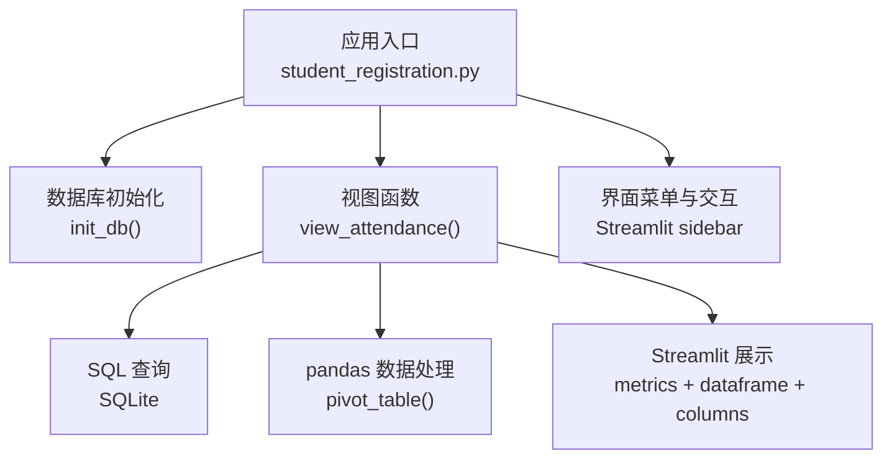
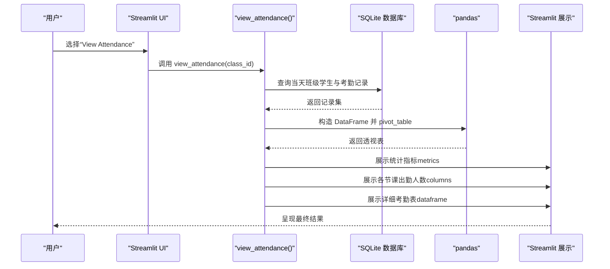
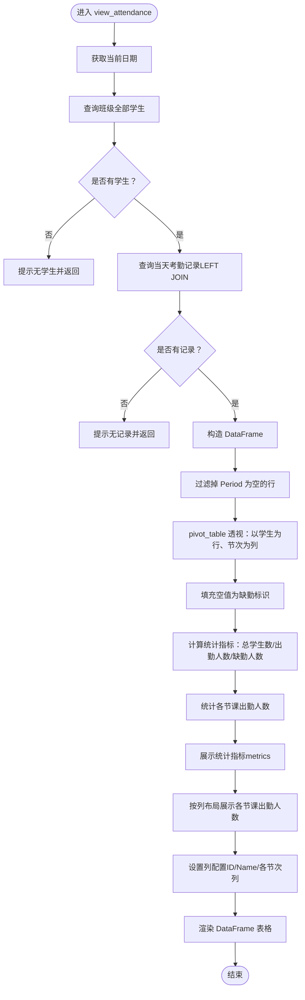
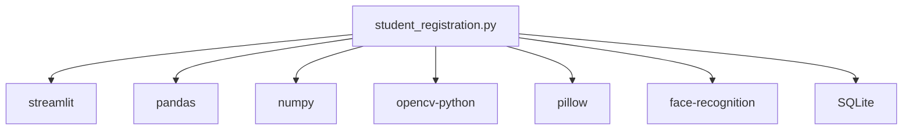

# 考勤查看

<cite>
**本文引用的文件**
- [README.md](file://README.md)
- [student_registration.py](file://student_registration.py)
- [requirements.txt](file://requirements.txt)
</cite>

## 目录
1. [简介](#简介)
2. [项目结构](#项目结构)
3. [核心组件](#核心组件)
4. [架构总览](#架构总览)
5. [详细组件分析](#详细组件分析)
6. [依赖关系分析](#依赖关系分析)
7. [性能考量](#性能考量)
8. [故障排查指南](#故障排查指南)
9. [结论](#结论)
10. [附录](#附录)

## 简介
本章节面向“考勤查看”功能，聚焦于 view_attendance 函数如何从数据库查询特定班级在当天的考勤记录，并通过 pandas 将数据透视为“以学生为行、节次为列”的表格，从而直观呈现每日出勤情况。文档还说明系统如何计算并展示关键统计指标（总学生数、出勤人数、缺勤人数），以及在没有考勤记录时的边界情况处理。最后，介绍如何利用 Streamlit 的列布局（columns）美观地展示各节课的出勤统计数据。

## 项目结构
该项目采用单文件 Streamlit 应用，包含数据库初始化、人脸识别、考勤标记与查看等全部逻辑。与“考勤查看”直接相关的实现集中在 student_registration.py 文件中，数据库结构由 README.md 描述，依赖项由 requirements.txt 列出。

图表来源
- [student_registration.py](file://student_registration.py#L1-L120)
- [README.md](file://README.md#L36-L41)

章节来源
- [README.md](file://README.md#L36-L41)
- [student_registration.py](file://student_registration.py#L1-L120)

## 核心组件
- 视图函数：view_attendance(class_id)
  - 功能：查询某班级当天的考勤记录，生成统计指标，并以表格形式展示。
  - 关键步骤：
    - 获取当前日期
    - 查询班级全部学生
    - 查询当天该班级的考勤记录（LEFT JOIN 保证无记录时也能返回学生）
    - 过滤掉没有考勤记录的行
    - 使用 pandas pivot_table 将“节次”转为列
    - 填充空值为缺勤标识
    - 计算总学生数、出勤人数、缺勤人数
    - 统计各节课出勤人数并以 metrics 展示
    - 使用列布局展示各节课出勤人数
    - 使用列配置优化表格列宽与标题
    - 渲染最终的 DataFrame 表格
- 数据库结构（来自 README）
  - classes：存储班级信息
  - students：存储学生信息及人脸编码
  - attendance：记录考勤数据（date、period、status）

章节来源
- [student_registration.py](file://student_registration.py#L684-L834)
- [README.md](file://README.md#L36-L41)

## 架构总览
下图展示了“考勤查看”在应用中的调用链路与数据流。

图表来源
- [student_registration.py](file://student_registration.py#L684-L834)

## 详细组件分析

### 视图函数：view_attendance(class_id)
- 输入：班级 ID
- 输出：当日考勤统计与表格
- 关键流程：
  1) 获取当前日期
  2) 查询班级全部学生
  3) 查询当天该班级的考勤记录（LEFT JOIN），确保即使无记录也返回学生
  4) 过滤掉没有考勤记录的行（Period 为空）
  5) 使用 pivot_table 将“节次”作为列，填充空值为缺勤标识
  6) 计算统计指标：总学生数、出勤人数、缺勤人数
  7) 统计各节课出勤人数并以 metrics 展示
  8) 使用列布局展示各节课出勤人数
  9) 使用列配置优化表格列宽与标题
  10) 渲染最终的 DataFrame 表格

图表来源
- [student_registration.py](file://student_registration.py#L684-L834)

章节来源
- [student_registration.py](file://student_registration.py#L684-L834)

### SQL 查询语义与边界情况
- 查询语义
  - 通过 LEFT JOIN 保证即使某学生当天无考勤记录也会出现在结果中，便于后续统计总人数。
  - 使用当前日期筛选当天记录。
- 边界情况
  - 班级无注册学生：直接提示并返回。
  - 当天无任何考勤记录：提示并建议先进行考勤打卡。
  - 学生当天无记录：在透视表中对应节次显示缺勤标识；统计上计入缺勤。

章节来源
- [student_registration.py](file://student_registration.py#L684-L731)

### pandas pivot_table 的使用
- 目标：将“节次”转为列，形成“学生-节次”二维表。
- 关键点：
  - index 为学生标识（ID、Name）
  - columns 为节次（Period）
  - values 为状态（Status）
  - aggfunc 为 first，避免重复时取第一条
  - 透视后重置索引，便于后续列配置与渲染
  - 填充空值为缺勤标识，使表格直观易读

章节来源
- [student_registration.py](file://student_registration.py#L733-L744)

### 统计指标与各节课出勤人数展示
- 统计指标
  - 总学生数：班级注册学生总数
  - 出勤人数：当天至少有一次出勤记录的学生数（去重）
  - 缺勤人数：总学生数 - 出勤人数
- 各节课出勤人数
  - 以“状态为 Present”为条件，按节次分组计数
  - 对节次进行数字排序
  - 当节次较多时分行展示，否则一行展示
  - 使用 Streamlit 的 metric 组件展示每节课的出勤人数

章节来源
- [student_registration.py](file://student_registration.py#L745-L795)

### Streamlit 列布局与表格美化
- 统计指标使用三列布局展示（总学生数、出勤人数、缺勤人数）
- 各节课出勤人数根据数量自动分行展示，使用 st.columns 动态分配列数
- 表格列配置
  - ID 列：NumberColumn，小宽度
  - Name 列：TextColumn，中等宽度
  - 各节次列：TextColumn，小宽度，标题为“第N节”
- 表格高度固定，支持横向滚动，提升大数据量下的可读性

章节来源
- [student_registration.py](file://student_registration.py#L754-L827)

## 依赖关系分析
- 外部库
  - streamlit：UI 与交互
  - pandas：数据透视与统计
  - numpy：数值计算
  - opencv-python：图像处理
  - pillow：图像读写
  - face-recognition：人脸特征提取与比较
- 内部模块
  - SQLite 数据库：存储 classes、students、attendance
  - view_attendance：核心业务逻辑
  - 其他辅助函数：数据库连接、验证、学生管理等

图表来源
- [requirements.txt](file://requirements.txt#L1-L6)
- [student_registration.py](file://student_registration.py#L1-L20)

章节来源
- [requirements.txt](file://requirements.txt#L1-L6)
- [student_registration.py](file://student_registration.py#L1-L20)

## 性能考量
- 数据库查询
  - 使用 LEFT JOIN 保证无记录时仍返回学生，避免额外查询。
  - 仅按日期筛选，索引建议：在 date 字段建立索引可进一步提升查询效率。
- pandas 处理
  - pivot_table 在中小规模数据下性能良好；若数据量大，可考虑预聚合或分页展示。
  - fillna 与 reset_index 操作成本较低，适合实时展示。
- Streamlit 渲染
  - 固定表格高度与列宽配置有助于提升渲染性能与用户体验。
  - 大量列时建议限制默认列数或提供筛选器。

[本节为通用性能建议，不直接分析具体文件]

## 故障排查指南
- 无学生或无记录
  - 若班级无注册学生，会提示并返回；若当天无记录，会提示并建议先进行考勤打卡。
- 数据库异常
  - 初始化数据库失败或连接错误时，会在启动阶段提示；可选择删除并重建数据库。
- 错误捕获
  - view_attendance 包含异常捕获与回溯输出，便于定位问题。

章节来源
- [student_registration.py](file://student_registration.py#L684-L731)
- [student_registration.py](file://student_registration.py#L829-L834)

## 结论
view_attendance 函数通过 SQLite 查询与 pandas 透视，将“学生-节次”维度的数据转化为直观的表格与统计指标。配合 Streamlit 的列布局与列配置，实现了清晰、美观的考勤查看体验。系统对边界情况（无学生、无记录）进行了妥善处理，并提供了可扩展的展示方式，便于后续增加更多统计维度与可视化元素。

[本节为总结性内容，不直接分析具体文件]

## 附录

### SQL 查询语义说明（路径参考）
- 查询班级全部学生
  - 参考路径：[student_registration.py](file://student_registration.py#L692-L703)
- 查询当天考勤记录（LEFT JOIN）
  - 参考路径：[student_registration.py](file://student_registration.py#L704-L714)

### pandas pivot_table 使用（路径参考）
- pivot_table 透视与空值填充
  - 参考路径：[student_registration.py](file://student_registration.py#L733-L744)

### 统计指标与各节课出勤人数展示（路径参考）
- 统计指标与各节课人数统计
  - 参考路径：[student_registration.py](file://student_registration.py#L745-L795)

### Streamlit 列布局与表格美化（路径参考）
- 统计指标列布局
  - 参考路径：[student_registration.py](file://student_registration.py#L754-L762)
- 各节课出勤人数列布局
  - 参考路径：[student_registration.py](file://student_registration.py#L765-L795)
- 表格列配置与渲染
  - 参考路径：[student_registration.py](file://student_registration.py#L800-L827)