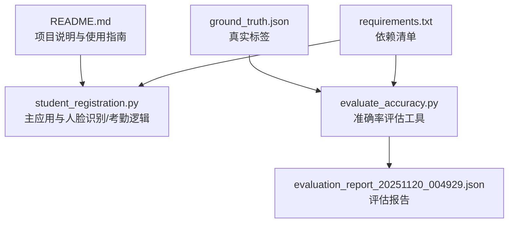
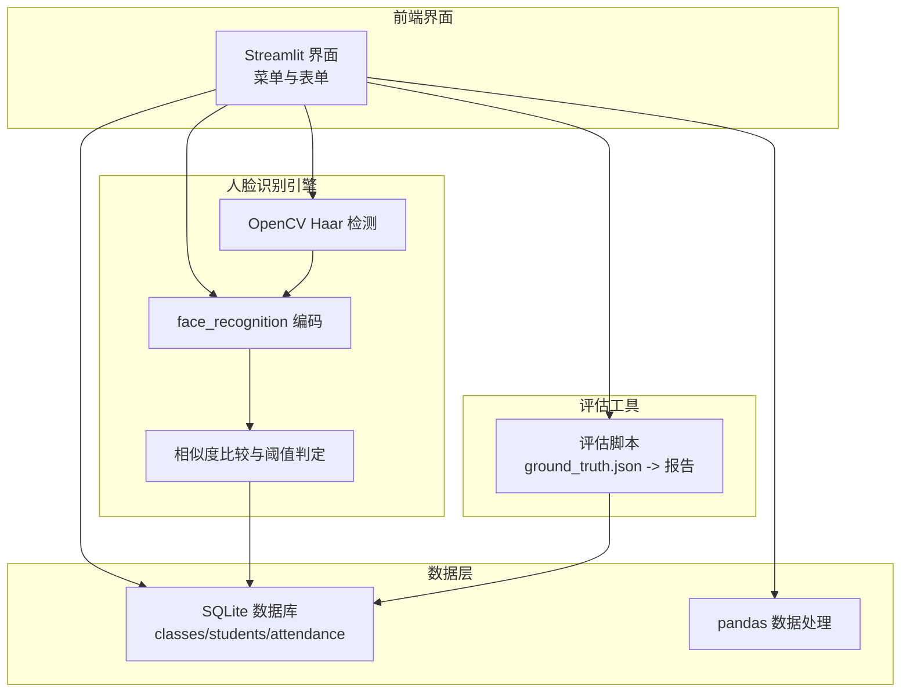
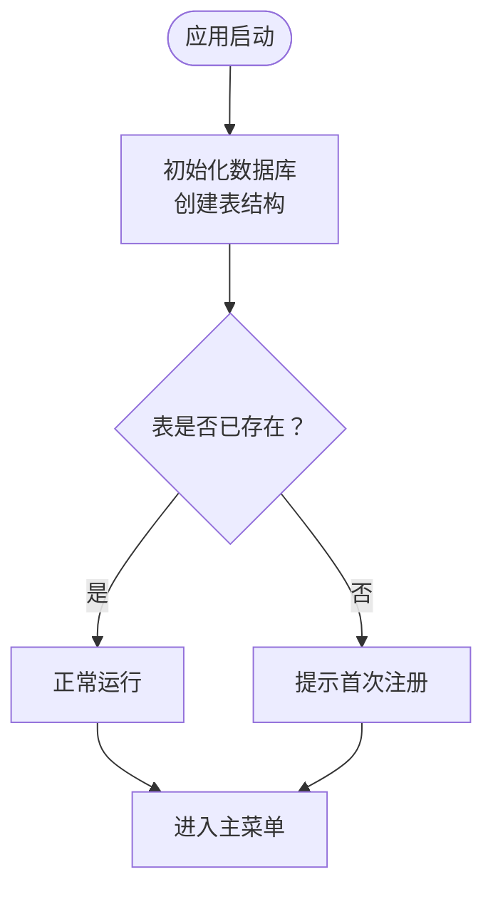
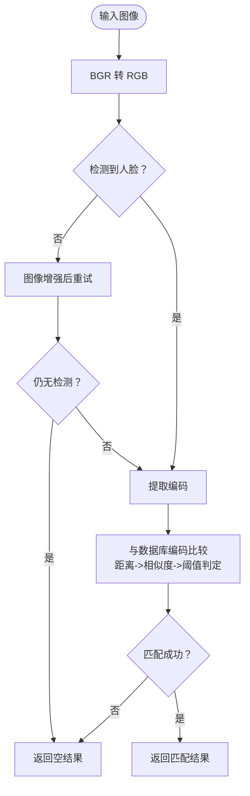
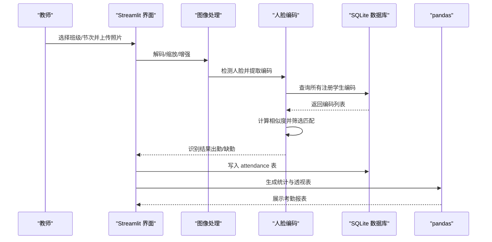
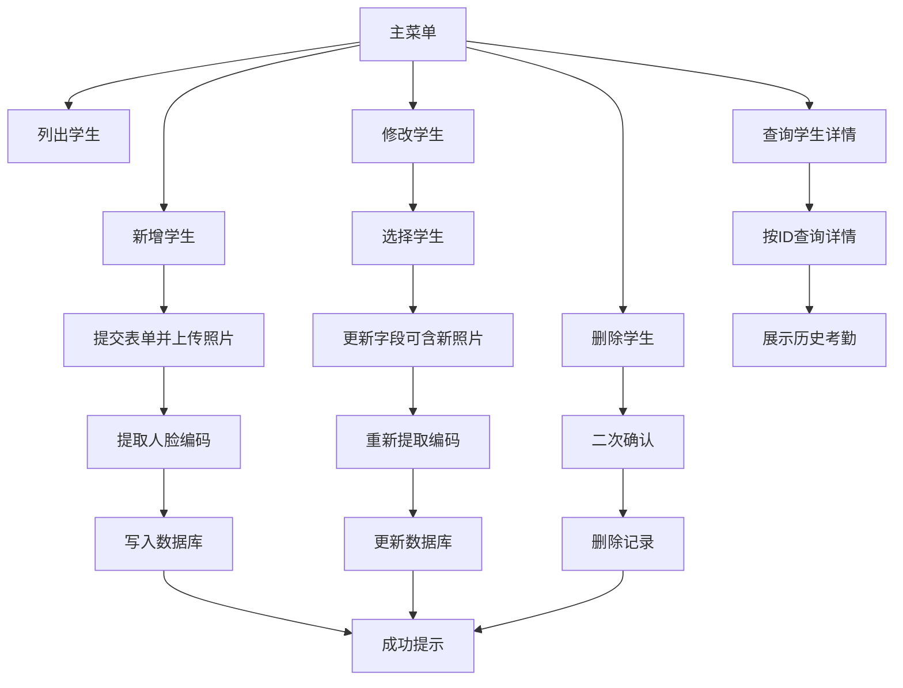
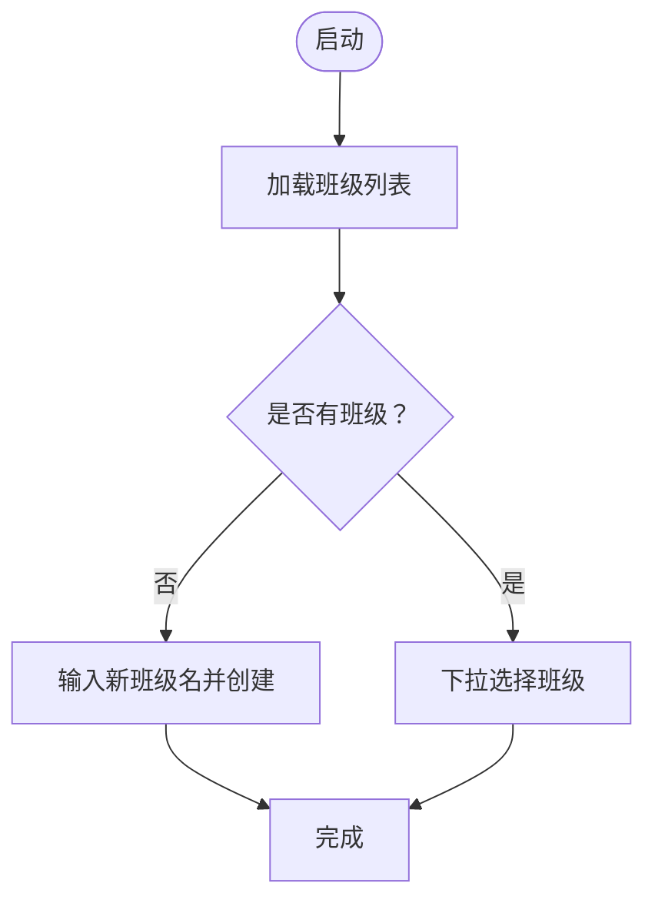
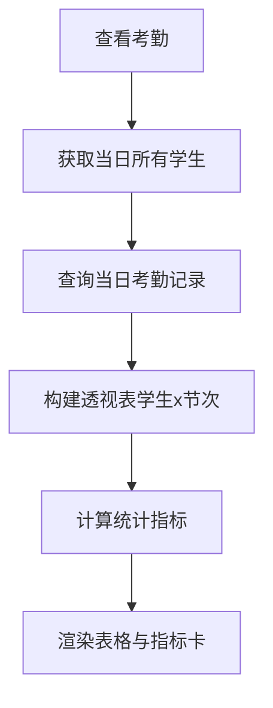
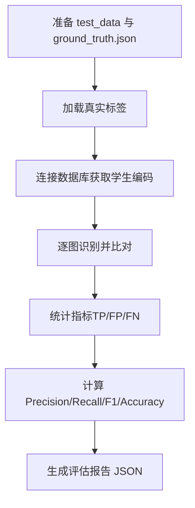
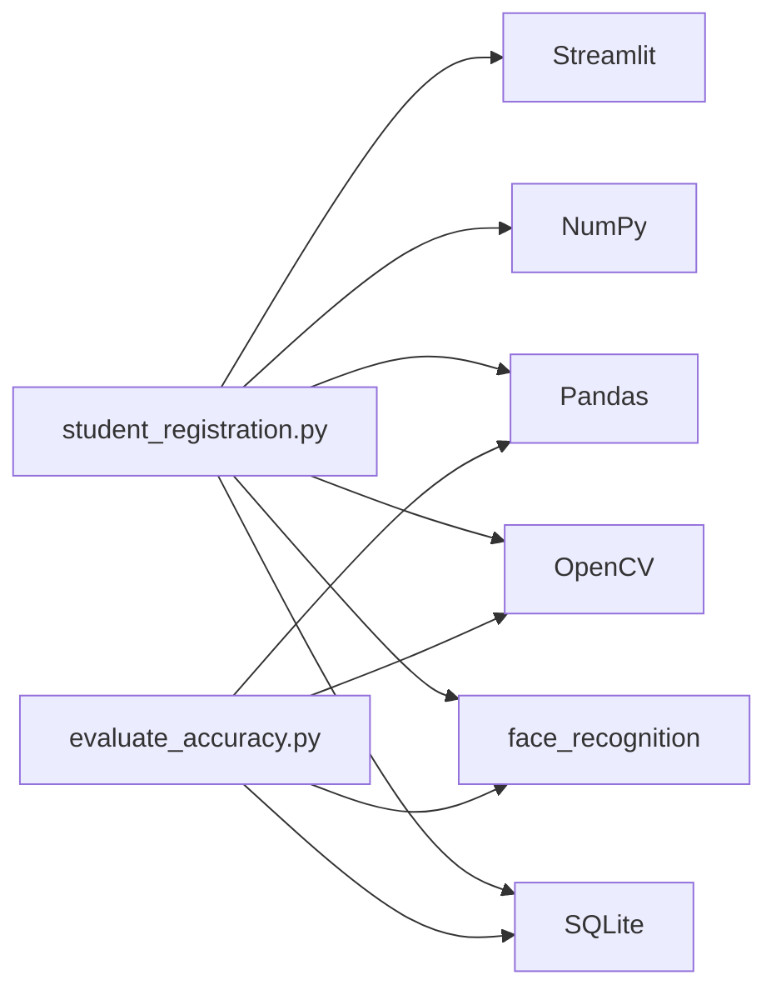

# 项目概述

<cite>
**本文引用的文件**
- [README.md](file://README.md)
- [student_registration.py](file://student_registration.py)
- [evaluate_accuracy.py](file://evaluate_accuracy.py)
- [requirements.txt](file://requirements.txt)
- [evaluation_report_20251120_004929.json](file://evaluation_report_20251120_004929.json)
- [ground_truth.json](file://ground_truth.json)
</cite>

## 目录
1. [简介](#简介)
2. [项目结构](#项目结构)
3. [核心组件](#核心组件)
4. [架构总览](#架构总览)
5. [详细组件分析](#详细组件分析)
6. [依赖关系分析](#依赖关系分析)
7. [性能考量](#性能考量)
8. [故障排查指南](#故障排查指南)
9. [结论](#结论)
10. [附录](#附录)

## 简介
SmartAttend 是一个基于 Streamlit 和 Python 的现代化人脸识别考勤系统，专为教育机构设计，旨在通过自动化人脸识别流程简化课堂考勤管理。系统提供直观的 Web 界面，结合 face_recognition 与 OpenCV 的图像处理能力，配合 SQLite 数据存储与 pandas 数据处理，实现从“班级管理”“学生注册”“考勤打卡”“考勤查看”到“学生信息管理”的完整闭环。

系统特色：
- 使用 OpenCV 的 Haar 级联分类器进行人脸检测，使用 face_recognition 库生成 128 维人脸编码，采用欧氏距离与阈值比较进行识别。
- 使用 Streamlit 构建交互式 Web 界面，便于教师快速完成日常考勤任务。
- 使用 SQLite 存储班级、学生与考勤数据；使用 pandas 进行考勤统计与可视化展示。
- 提供准确率评估工具，支持离线测试与报告生成，便于持续优化识别效果。

**章节来源**
- [README.md](file://README.md#L1-L127)

## 项目结构
仓库采用功能模块化组织，核心文件如下：
- README.md：项目说明、特性、技术实现、安装与使用指南、故障排查等。
- student_registration.py：主应用入口，包含数据库初始化、人脸识别与考勤逻辑、Streamlit 界面与菜单。
- evaluate_accuracy.py：准确率评估工具，支持加载真实标签、批量识别并输出评估报告。
- requirements.txt：运行所需依赖包版本。
- evaluation_report_20251120_004929.json：评估报告示例。
- ground_truth.json：评估用的真实标签示例。

**图表来源**
- [README.md](file://README.md#L1-L127)
- [student_registration.py](file://student_registration.py#L1-L120)
- [evaluate_accuracy.py](file://evaluate_accuracy.py#L1-L60)
- [requirements.txt](file://requirements.txt#L1-L6)

**章节来源**
- [README.md](file://README.md#L1-L127)
- [requirements.txt](file://requirements.txt#L1-L6)

## 核心组件
- 数据库层
  - 初始化与校验：启动时自动创建 classes、students、attendance 表；支持数据库重置。
  - 结构：classes（id, class_name）、students（id, class_id, name, age, email, image, face_encoding）、attendance（id, student_id, class_id, date, period, status）。
- 人脸识别与特征提取
  - 单张图特征提取：用于学生注册阶段，确保上传照片中存在清晰人脸并生成编码。
  - 多张图特征提取：用于考勤打卡阶段，支持 HOG/CNN 模型与图像增强策略，提升检测鲁棒性。
  - 特征比较：将实时人脸编码与数据库中存储的编码进行距离计算与相似度转换，设定阈值进行匹配。
- 考勤流程
  - 识别：遍历每张照片中检测到的人脸，与所有注册学生进行比对，保留最高相似度匹配。
  - 标记：若匹配成功且未重复，则写入 attendance 表；统计出勤与缺勤并展示汇总。
- 数据处理与展示
  - 使用 pandas 将考勤记录转为透视表，按节次列展示状态；提供统计指标与表格滚动展示。
- 评估工具
  - 支持加载 ground_truth.json，逐图识别并计算精确率、召回率、F1 与整体准确率，导出 JSON 报告。

**章节来源**
- [student_registration.py](file://student_registration.py#L18-L49)
- [student_registration.py](file://student_registration.py#L57-L127)
- [student_registration.py](file://student_registration.py#L128-L146)
- [student_registration.py](file://student_registration.py#L489-L683)
- [student_registration.py](file://student_registration.py#L684-L835)
- [evaluate_accuracy.py](file://evaluate_accuracy.py#L25-L96)
- [evaluate_accuracy.py](file://evaluate_accuracy.py#L98-L214)

## 架构总览
系统采用“前端界面 + 人脸识别引擎 + 数据存储 + 数据处理”的分层架构：
- 前端界面：Streamlit 提供 Web 交互，菜单驱动各类功能。
- 人脸识别引擎：OpenCV + face_recognition，负责检测、编码与比对。
- 数据存储：SQLite，持久化班级、学生与考勤数据。
- 数据处理：pandas，用于考勤统计与表格展示。
- 评估工具：独立脚本，支持离线评估与报告生成。

**图表来源**
- [student_registration.py](file://student_registration.py#L1-L120)
- [student_registration.py](file://student_registration.py#L489-L683)
- [student_registration.py](file://student_registration.py#L684-L835)
- [evaluate_accuracy.py](file://evaluate_accuracy.py#L25-L96)
- [evaluate_accuracy.py](file://evaluate_accuracy.py#L98-L214)

## 详细组件分析

### 数据库初始化与校验
- 初始化：启动时创建 classes、students、attendance 表，确保字段类型与约束满足业务需求。
- 校验：检查表是否存在，为空则提示首次注册；异常时给出错误信息。
- 重置：提供“删除数据库”选项，删除后重建表结构，便于修复损坏状态。

**图表来源**
- [student_registration.py](file://student_registration.py#L18-L53)
- [student_registration.py](file://student_registration.py#L156-L178)
- [student_registration.py](file://student_registration.py#L994-L1005)

**章节来源**
- [student_registration.py](file://student_registration.py#L18-L53)
- [student_registration.py](file://student_registration.py#L156-L178)
- [student_registration.py](file://student_registration.py#L994-L1005)

### 人脸识别与特征提取
- 单张图提取：将 BGR 转 RGB，使用 face_recognition 检测人脸位置并生成编码；若无人脸则提示重试。
- 多张图提取：优先 HOG 模型，失败则尝试 CNN；若仍失败则增强图像后再次检测；最终返回编码与位置列表。
- 特征比较：将实时编码与数据库编码进行距离计算，转换为相似度，与阈值比较决定匹配。

**图表来源**
- [student_registration.py](file://student_registration.py#L57-L127)
- [student_registration.py](file://student_registration.py#L128-L146)

**章节来源**
- [student_registration.py](file://student_registration.py#L57-L127)
- [student_registration.py](file://student_registration.py#L128-L146)

### 考勤打卡流程
- 输入：选择班级与节次，上传一组课堂照片。
- 处理：逐图检测人脸，提取编码并与所有注册学生比对，保留最高相似度；去重后形成识别集。
- 写入：若当日同节次无记录，则写入 attendance 表；统计出勤与缺勤并展示。
- 展示：汇总统计与明细表格，支持横向滚动查看多节次。

**图表来源**
- [student_registration.py](file://student_registration.py#L489-L683)
- [student_registration.py](file://student_registration.py#L684-L835)

**章节来源**
- [student_registration.py](file://student_registration.py#L489-L683)
- [student_registration.py](file://student_registration.py#L684-L835)

### 学生信息管理
- 列表：按班级列出学生，显示照片与基本信息。
- 新增：填写姓名、年龄、邮箱，上传照片，自动生成编码并入库。
- 修改：支持更新姓名、年龄、邮箱与照片（重新提取编码）。
- 删除：删除学生及其全部考勤记录，提供二次确认。
- 查询：按 ID 获取学生详情与历史考勤。

**图表来源**
- [student_registration.py](file://student_registration.py#L254-L452)
- [student_registration.py](file://student_registration.py#L836-L1005)

**章节来源**
- [student_registration.py](file://student_registration.py#L254-L452)
- [student_registration.py](file://student_registration.py#L836-L1005)

### 班级管理
- 创建：输入班级名称，写入 classes 表。
- 选择：启动时加载所有班级，支持切换。
- 辅助：按班级维度隔离数据，避免跨班干扰。

**图表来源**
- [student_registration.py](file://student_registration.py#L227-L241)
- [student_registration.py](file://student_registration.py#L843-L858)

**章节来源**
- [student_registration.py](file://student_registration.py#L227-L241)
- [student_registration.py](file://student_registration.py#L843-L858)

### 考勤查看与统计
- 当日统计：计算总学生数、已出勤、未出勤人数。
- 各节统计：按节次聚合出勤人数，支持多列展示。
- 表格展示：透视表按学生与节次排列，支持横向滚动。

**图表来源**
- [student_registration.py](file://student_registration.py#L684-L835)

**章节来源**
- [student_registration.py](file://student_registration.py#L684-L835)

### 准确率评估工具
- 输入：test_data 目录中的测试照片与 ground_truth.json 标注。
- 流程：逐图检测与编码，与数据库中学生编码比对，计算 TP/FP/FN 并统计 Precision/Recall/F1/Accuracy。
- 输出：生成 evaluation_report_日期时间.json，包含总体指标与详细结果。

**图表来源**
- [evaluate_accuracy.py](file://evaluate_accuracy.py#L25-L96)
- [evaluate_accuracy.py](file://evaluate_accuracy.py#L98-L214)
- [evaluation_report_20251120_004929.json](file://evaluation_report_20251120_004929.json#L1-L40)
- [ground_truth.json](file://ground_truth.json#L1-L40)

**章节来源**
- [evaluate_accuracy.py](file://evaluate_accuracy.py#L25-L96)
- [evaluate_accuracy.py](file://evaluate_accuracy.py#L98-L214)
- [evaluation_report_20251120_004929.json](file://evaluation_report_20251120_004929.json#L1-L40)
- [ground_truth.json](file://ground_truth.json#L1-L40)

## 依赖关系分析
- 运行时依赖：Streamlit、NumPy、Pandas、Pillow、OpenCV、face_recognition。
- 人脸识别链路：OpenCV 负责检测，face_recognition 负责编码，两者共同构成识别管道。
- 数据处理链路：pandas 负责考勤数据的透视与统计，Streamlit 负责前端展示。
- 评估链路：评估脚本直接读取数据库与测试照片，生成报告文件。

**图表来源**
- [requirements.txt](file://requirements.txt#L1-L6)
- [student_registration.py](file://student_registration.py#L1-L20)
- [evaluate_accuracy.py](file://evaluate_accuracy.py#L17-L24)

**章节来源**
- [requirements.txt](file://requirements.txt#L1-L6)
- [student_registration.py](file://student_registration.py#L1-L20)
- [evaluate_accuracy.py](file://evaluate_accuracy.py#L17-L24)

## 性能考量
- 图像预处理：对大图进行缩放以提升处理速度；在检测失败时进行图像增强，平衡准确率与性能。
- 模型选择：优先 HOG 模型以加速检测，必要时回退 CNN 模型以提升准确性。
- 数据库访问：批量查询与插入，避免频繁 IO；对重复考勤记录进行去重与幂等判断。
- 前端渲染：使用列配置与固定列宽，优化表格展示与滚动体验。

[本节为通用性能建议，不直接分析具体文件]

## 故障排查指南
- 人脸识别问题
  - 光照不足、角度不佳、遮挡或照片模糊会导致检测失败。建议使用正面、清晰、高分辨率照片。
  - 若多次尝试仍失败，可启用图像增强策略或更换模型。
- 数据库问题
  - 若出现数据库错误，可使用“删除数据库”选项重置，系统会自动重建表结构。
- 识别阈值
  - 系统默认阈值较高以保证准确性；若识别率偏低，可在评估工具中调整阈值并重新评估。

**章节来源**
- [student_registration.py](file://student_registration.py#L77-L127)
- [student_registration.py](file://student_registration.py#L994-L1005)
- [README.md](file://README.md#L101-L116)

## 结论
SmartAttend 通过 Streamlit 提供简洁易用的 Web 界面，结合 OpenCV 与 face_recognition 的强大能力，实现了从“班级管理”“学生注册”“考勤打卡”“考勤查看”到“学生信息管理”的全链路自动化。SQLite 与 pandas 的组合确保了数据的可靠存储与高效统计。评估工具进一步帮助用户量化识别效果并持续优化。该系统适合中小规模教育机构快速部署与迭代。

[本节为总结性内容，不直接分析具体文件]

## 附录
- 安装与启动
  - 克隆仓库并安装依赖后，使用 Streamlit 启动主程序。
  - 首次启动需创建班级并注册学生照片，随后即可进行考勤打卡与查看。
- 使用建议
  - 为每位学生准备正面、清晰的注册照片，有助于提升识别准确率。
  - 定期使用评估工具对系统进行离线测试，根据报告调整阈值与采集规范。

**章节来源**
- [README.md](file://README.md#L48-L76)
- [README.md](file://README.md#L77-L100)